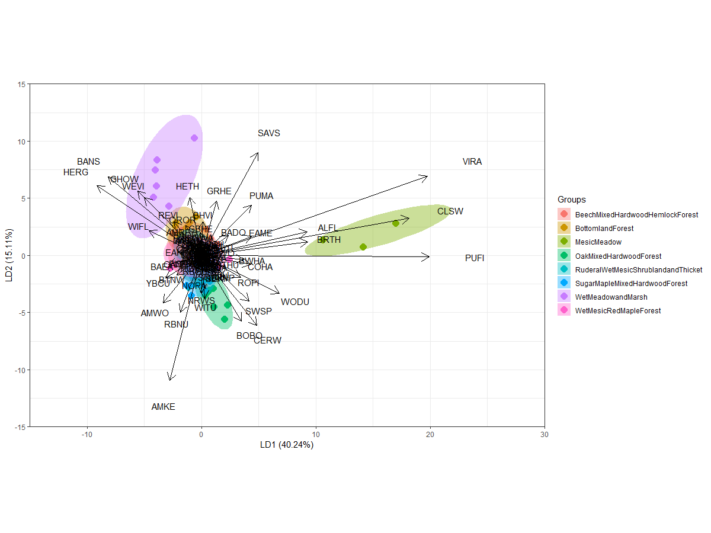
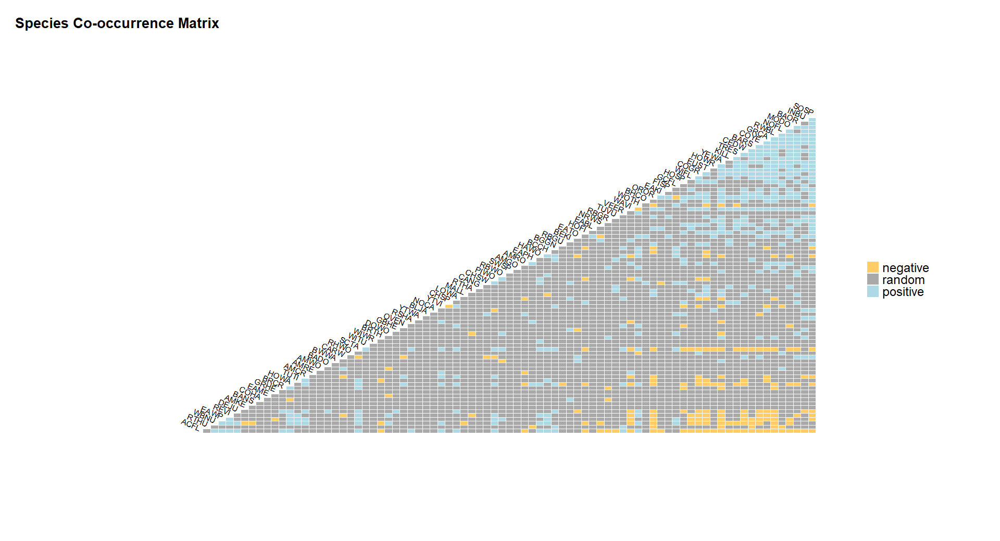

```{r setup, include=FALSE}
knitr::opts_chunk$set(echo = TRUE,out.width = "100%")

options(width=1200)
```

```{r, echo = FALSE,warning=FALSE,error=FALSE,message=FALSE}

library(dplyr)
library(tidyverse)
library(vegan)
library(caret)
library(lubridate)
library(spOccupancy)
library(vegan)
library(raster)
library(dismo)
library(terra)
library(sp)
library(rgdal)
library(gstat)
library(broom)
library(shiny)
library(sp)
library(ggplot2)
library(RColorBrewer)
library(rgdal)
library(broom)
library(AICcmodavg)
library(indicspecies)
library(lme4)
library(MASS)
library(cooccur)
library(igraph)
library(visNetwork)

#options(repos = c(
#    fawda123 = 'https://fawda123.r-universe.dev',
#    CRAN = 'https://cloud.r-project.org'))

# Install ggord
#install.packages('ggord')
library(ggord)

#code from here: https://www.r-bloggers.com/2011/11/outersect-the-opposite-of-rs-intersect-function/#:~:text=setdiff()%20produces%20all%20elements,vector%20(i.e.%20is%20asymmetric).
outersect <- function(x, y, ...) {
  big.vec <- c(x, y, ...)
  duplicates <- big.vec[duplicated(big.vec)]
  setdiff(big.vec, unique(duplicates))
}

lda_birdcomm<-readRDS("lda_birdcomm.rds")

```

# The dataset

Tim Krynak, Erik Shaffer, Jen Brumfield, and other Cleveland Metroparks and affiliated colleagues conducted Breeding Bird Surveys (BBS) at a total of 211 routes between 2017 and 2021. 164 of these routes overlapped with long-term vegetation monitoring efforts through the Cleveland Metroparks Plant Community Assessment Program (PCAP). This provided an excellent opportunity to explore the potential relationships between vegetative composition, landscape structure, and breeding bird ecology and community composition. 

# Initial processing

First, we just read in the full BBS dataset. For our purposes, we will remove any BBS observations not paired with PCAP plots. We can also visualize the distribution of survey effort through time. 

```{r}
CMP_bbs_pcap_join<-read.csv("G:/NaturalResources/Byer/datasets/BBS/CMP_bbs_pcapjoin_elimWC_EATO.csv",header=T)
CMP_bbs_pcap_join_pcaponly<-CMP_bbs_pcap_join[!is.na(CMP_bbs_pcap_join$Plot.ID),]

datetime<-strptime(CMP_bbs_pcap_join_pcaponly$survey_cre,format="%m/%d/%Y %H:%M")
hist(datetime,breaks="months")

pcap_1styear_landscape<-read.csv("G:/NaturalResources/Byer/datasets/BBS/pcap_4yr_landscape_variables_202204281228.csv",header=T)


```

Next, we need to start grouping this dataset for downsteram analysis. This involves summarizing counts of each species for each plot. We also replace any NA values in the data frame with zeroes - this will be important for downstream applications, as we want to distinguish between unobserved species at a plot and check (typically coded 0s) and checks that were "skipped" (NAs).

```{r,warning=FALSE,error=FALSE,message=FALSE}
CMP_bbs_pcap_join_pcaponly_pcapsum<-CMP_bbs_pcap_join_pcaponly %>% 
  group_by(simp_plot, reservatio,community,species_4_) %>%
  summarise(n=n(),longitude=mean(xcoord), latitude=mean(ycoord),vibifq=mean(vibi_fq),vibifqnotrees=mean(vibi_fq_no_trees),carex=mean(carex_metric_value),cyper=mean(cyperaceae_metric_value),
            dicot=mean(dicot_metric_value),shade=mean(shade_metric_value),shrub=mean(shrub_metric_value),
            hydro=mean(hydrophyte_metric_value),svp=mean(svp_metric_value),ap=mean(ap_ratio_metric_value),
            fqi=mean(fqai_score),bryo=mean(bryophyte_metric_value),hydro_rel=mean(hydrophyte_rel_cov_metric_value),
            hydro_rel_notrees=mean(hydrophyte_rel_cov_no_trees),
            sens_rel=mean(sensitive_rel_cov_metric_value),
            sens_rel_notree=mean(sensitive_rel_cov_no_trees),
            tol_rel=mean(tolerant_rel_cov_metric_value),
            tol_rel_notree=mean(tolerant_rel_cov_no_trees),
            inv=mean(invasive_graminoids_metric_value),
            small_tree=mean(small_tree_metric_value),
            subcanopy=mean(subcanopy_iv),
            canopy=mean(canopy_iv.1)
            ) %>%
  spread(species_4_,n) %>%
  replace(is.na(.),0)

names(pcap_1styear_landscape)[names(pcap_1styear_landscape) == 'site.name'] <- 'simp_plot'


CMP_bbs_pcap_join_pcaponly_pcapsum_landscape<-left_join(x = CMP_bbs_pcap_join_pcaponly_pcapsum,y = pcap_1styear_landscape,by="simp_plot")

CMP_bbs_pcap_join_pcaponly_pcapsum<-column_to_rownames(CMP_bbs_pcap_join_pcaponly_pcapsum_landscape,var="simp_plot")


```

This is a pretty unwieldly dataset at present - we have 164 rows (representing our BBS/PCAP plots) and 131 columns. Out of those 131 columns, 103 are unique species (designated with four-letter codes), so most of the first 27 covariates are essentially our "predictors" - in this case, our PCAP data.

Let's do a bit more processing on this dataset to get it in shape for downstream analyses. First, we will separate out our bird community data.

```{r,warning=FALSE,error=FALSE,message=FALSE}

birdcomm<-CMP_bbs_pcap_join_pcaponly_pcapsum[,28:(130)]

birdcomm[is.na(birdcomm)] <- 0

```

Next, we separate out our PCAP data. 

```{r,warning=FALSE,error=FALSE,message=FALSE}
vegecomm<-CMP_bbs_pcap_join_pcaponly_pcapsum[,5:26]

```

Finally, we will separate out the 1st year landscape covariates. As a quick note, these will not be *strictly* comparable with the 2nd survey landscape covariates, but should be pretty close (~5 years is likely not enough for substantial land cover change).

```{r,warning=FALSE,error=FALSE,message=FALSE}
landcomm<-CMP_bbs_pcap_join_pcaponly_pcapsum[,142:153]

landcomm[is.na(landcomm)] <- 0

```

Since we are using the PCAP dataset as predictors here, we should likely check for correlations between these covariates. I have selected a (semi-)arbitrary cut-off of 0.6 to identify covariates as correlated; we then drop any covariates that are likely redundant.

```{r,warning=FALSE,error=FALSE,message=FALSE}

vegecomm_cor<-cor(vegecomm)

set.seed(12345)
corvar<-findCorrelation(vegecomm_cor,cutoff=0.6)

vegecomm_drop<-vegecomm[,-corvar]
```

We can also check for correlations between the landscape covariates.

```{r,warning=FALSE,error=FALSE,message=FALSE}

landcomm_cor<-cor(landcomm)

set.seed(12345)
corvar_land<-findCorrelation(landcomm_cor,cutoff=0.6)

landcomm_drop<-landcomm[,-corvar_land]

#also dropping developed edge

landcomm_drop<-landcomm_drop[,-5]
```

We can then check correlations between PCAP and landscape covariates.

```{r,warning=FALSE,error=FALSE,message=FALSE}

landvegcomm_drop<-cbind(vegecomm_drop,landcomm_drop)

landvegcomm_drop_cor<-cor(landvegcomm_drop)

set.seed(12345)
corvar_landveg<-findCorrelation(landvegcomm_drop_cor,cutoff=0.6)

```

No covariates were overly correlated in this dataset, so we can proceed.

Now, we have:

a) a vegecomm dataset - which representing PCAP measurements for each of the 164 BBS/PCAP plots.
b) a birdcomm dataset - representing presence/absence of each bird species for each survey in each plot.
c) a landcomm dataset - representing landscape covariates associated with these PCAP plots.

Note that we are not explicitly considering differences in bird counts (or occupancy, or detectability) through time at this point - we will get to that later. For now, we just want to explore broad associations between these three datasets! 

Note as of 6/13/2022 - we will also want to only work with only binary data. 

# Community analyses

 When working with datasets like these, we first have to acknowledge that these datasets are multivariate - with many possible predictor covariates (for example, plot-level characteristics) and many possible response covariates (for example, presence/absence of species in a plot). Fortunately, community ecology as a field has developed a number of standard approaches for exploring multivariate datasets, of which the most common is (arguably!) ordination. In essence, ordination techniques try to shrink down highly multidimensional datasets into a more manageable number of dimensions - often just a handful (and for initial plotting, typically just two). There are many, many possible ordination tools available for exploring community ecological datasets, and we will explore a few. 

## unconstrained ordination

In this section, we will be exploring ways of exploring the bird dataset on its own - basically, without any predictors. 

First, we must reclassify our bird community data onto a binary scale - ranging from 0 (no detection) to 1 (detection).

We also set our color palette for residency status, so that Red = resident, Green = short-distance migrant, and Blue = neotropical migrant.

```{r,warning=FALSE,error=FALSE,message=FALSE}


birdcomm_bin<-birdcomm

birdcomm_bin<- birdcomm_bin %>% mutate_if(is.numeric, ~1 * (. >= 1))

BBSMigrants<-read.csv("G:/NaturalResources/Byer/datasets/BBS/BBS Migants.csv",header=T)

BBSMigrants_sub<-BBSMigrants[BBSMigrants$SpeciesCode %in% colnames(birdcomm_bin),]

Residency<-BBSMigrants_sub$Residency

color_resid<-Residency

color_resid[color_resid %in% "NE"]<-"blue"

color_resid[color_resid %in% "M"]<-"green"

color_resid[color_resid %in% "R"]<-"red"

BBSMigrants_sub$color_resid<-color_resid


```

One of the most common approaches for unconstrained ordination is called Principal Components Analysis (PCA). I have illustrated vegan's rda() function (which we will use a bit more below!). Out of the available options, I find rda() to be much easier to use, so I tend to use it preferentially. Here is a plot with convex hulls and points colored by reservation.

```{r,warning=FALSE,error=FALSE,message=FALSE,echo=FALSE}
reserv<-factor(toupper(CMP_bbs_pcap_join_pcaponly_pcapsum$reservatio))
colpal_reserv<-rainbow(length(levels(reserv)))

p_unconc<-rda(birdcomm_bin,scale=T)

PCAscores <- scores(p_unconc, display = "sites") %>% 
  as.data.frame() %>% 
  rownames_to_column("site") 

PCAvect <- scores(p_unconc, display = "species") %>% 
  as.data.frame()

reservplot<-ordiplot(p_unconc,scaling=3,type="n")
points(reservplot, "sites",pch=21, col=colpal_reserv[reserv])


ordihull(reservplot,groups = reserv, col=colpal_reserv, lwd=3)
title("PCA (vegan rda version)")
legend(x="right", legend=levels(reserv), col=colpal_reserv,pch = 1,cex=0.5) 

```

while a bit hard to interpret, plots within Rocky River (RR) seem to be the most variable - and it might be that we see higher diversity in that area. We will see as we proceed if that is true.

### metric multidimensional scaling (Principal Coordinates Analysis)

You can think of this as a distance-based analog to PCA. In this case, since we are using Bray-Curtis distances on binary data (presence/absence), this is equivalent to Sorensen's index. 

```{r,warning=FALSE,error=FALSE,message=FALSE, echo = FALSE}
bird_pcoa<-capscale(birdcomm_bin~1,distance="bray")

plot(bird_pcoa,type="n",main="PCoA") 

text(bird_pcoa,display="species",col=BBSMigrants_sub$color_resid,cex=0.6) 

points(bird_pcoa,display="sites",pch=16) #adds filled circles for sites

```


### non-metric multidimensional scaling

```{r,warning=FALSE,error=FALSE,message=FALSE,echo=FALSE}
bird_nmds<-metaMDS(birdcomm_bin,distance = "bray",trymax = 400,k=3,trace=FALSE)


plot(bird_nmds,type="n",main="NMDS") 

text(bird_nmds,display="species",col=BBSMigrants_sub$color_resid,cex=0.6) 

points(bird_nmds,display="sites",pch=16) #adds filled circles for sites


```

### bird species most associated with community differences

We can also look at which birds are most differentiated across communities for both the PCOA and NMDS ordinations. The below code essentially a) relates individual bird presence/absence to the final PCOA ordination, b) extracts p-values for associations with MDS1 and 2 (the first two ordination axes), and c) selects only those birds that are most differentiated at p less than or equal to 0.001. We will do so for the PCA, PCOA, and NMDS.

For all of these analyses, keep in mind that these are differentiated across *plots*, rather than reservations. We will explore a way to identify reservation-level differentiated species a litle bit below.

Here is the PCA:

```{r,warning=FALSE,error=FALSE,message=FALSE,echo=FALSE}
p_unconc<-rda(birdcomm_bin,scale=T)

fitpca <- envfit(p_unconc, birdcomm_bin, perm = 999) 

# extract p-values for each species
fitpca_pvals <- fitpca$vectors$pvals %>% 
  as.data.frame() %>% 
  rownames_to_column("species") %>% 
  dplyr::rename("pvals" = ".")

# extract coordinates for species, only keep species with p-val = 0.001
fitpca_spp <- fitpca %>% 
  scores(., display = "vectors") %>% 
  as.data.frame() %>% 
  rownames_to_column("species") %>% 
  full_join(., fitpca_pvals, by = "species") %>% 
  filter(pvals == 0.001)

fitpca_spp
```

**47 species** were identified as significantly contributing to variation between plots. These are my best attempts to break these down by typical migratory patterns for each species in Ohio (courtesy of www.allaboutbirds.org).

Neotropical migrants: Acadian Fly-Catcher, Baltimore Oriole, Barn Swallow, Common Yellowthroat, Eastern Kingbird, Eastern Wood-Pewee, Great Crested Flycatcher, Hooded Warbler, Indigo Bunting, Orchard Oriole, Rose-Breasted Grosbeak, Red-Eyed Vireo, Scarlet Tanager, Warbling Vireo, Willow Flycatcher, Wood Thrush, Yellow Warbler, Yellow-Throated Vireo = **18 species**

Resident: American Crow, American Kestrel, European Starling, Hairy Woodpecker, House Sparrow, Pileated Woodpecker, Song Sparrow, White-Breasted Nuthatch = **8 species** 

Short-distance migrant: American Goldfinch, Black-capped Chickadee, Blue-Gray Gnatcatcher, Brown-headed Cowbird, Brown Thrasher, Cedar Waxwing, Common Grackle, Eastern Bluebird, Eastern Meadowlark, Field Sparrow, Gray Catbird, House Wren, Killdeer, Mourning Dove, Northern Flicker, Northern Rough-winged Swallow, Red-winged Blackbird, Tree Swallow, Turkey Vulture = **19 species**

Resident or migratory: Canada Goose, Dark-eyed Junco = **2 species**

We can repeat this procedure for the PCOA results too. Whereas PCA (above) was based on summarizing our bird community in the fewest number of axes that explain the most *variance*, PCOA is trying to maximize *distance* between plots. This is somewhat semantic in many cases, but will lead to differing representations of which birds are most associated with ordination axes.

Anyway! on to the PCOA: 

```{r,warning=FALSE,error=FALSE,message=FALSE,echo=FALSE}
# envfit() takes the output of metaMDS() and the species matrix you created
fitpcoa <- envfit(bird_pcoa, birdcomm_bin, perm = 999) 

CMP_bbs_pcap_join_pcaponly_pcapsum$site<-rownames(CMP_bbs_pcap_join_pcaponly_pcapsum)

plot_df_pcoa <- scores(bird_pcoa, display = "sites") %>% 
  as.data.frame() %>% 
  rownames_to_column("site") %>% 
  full_join(CMP_bbs_pcap_join_pcaponly_pcapsum, by = "site")


# extract p-values for each species
fitpcoa_pvals <- fitpcoa$vectors$pvals %>% 
  as.data.frame() %>% 
  rownames_to_column("species") %>% 
  dplyr::rename("pvals" = ".")

# extract coordinates for species, only keep species with p-val = 0.001
fit_pcoa_spp <- fitpcoa %>% 
  scores(., display = "vectors") %>% 
  as.data.frame() %>% 
  rownames_to_column("species") %>% 
  full_join(., fitpcoa_pvals, by = "species") %>% 
  filter(pvals == 0.001)

fit_pcoa_spp


BBSMigrants_sub_pcoasig<-BBSMigrants_sub[BBSMigrants_sub$SpeciesCode %in% fit_pcoa_spp$species,]

BBSMigrants_sub_pcoasig_reorder<-BBSMigrants_sub_pcoasig[order(BBSMigrants_sub_pcoasig$SpeciesCode),]

fit_pcoa_spp_reorder<-fit_pcoa_spp[order(fit_pcoa_spp$species),]

fit_pcoa_spp_join<-cbind(fit_pcoa_spp_reorder,BBSMigrants_sub_pcoasig_reorder)


fit_pcoa_spp_order<-fit_pcoa_spp_join[order(fit_pcoa_spp_join$MDS1),]
fit_pcoa_spp_order$species<-factor(fit_pcoa_spp_order$species,levels=fit_pcoa_spp_order$species)

fit_pcoa_spp_order$color_resid[fit_pcoa_spp_order$Residency %in% "NE"]<-"blue"

fit_pcoa_spp_order$color_resid[fit_pcoa_spp_order$Residency %in% "M"]<-"green3"

fit_pcoa_spp_order$color_resid[fit_pcoa_spp_order$Residency %in% "R"]<-"red"

col_pcoa<-fit_pcoa_spp_order$color_resid

color_sub<-fit_pcoa_spp_order$color_resid
pcoa_plot_new <- ggplot(plot_df_pcoa, aes(x = MDS1, y = MDS2)) +
  labs(color="Reservation")+
  coord_fixed(xlim=c(-2,2),ylim=c(-2,2)) + theme_classic(base_size=24)+
  geom_point(aes(color = reservatio), size = 3, alpha = 0.8)+
  stat_ellipse(aes(color = reservatio),size=1.5) +
  geom_segment(data = fit_pcoa_spp_order, aes(x = 0, xend = MDS1, y = 0, yend = MDS2), col = col_pcoa,size=1.25) +
  geom_text(data = fit_pcoa_spp_order, aes(label = SpeciesCode),colour=col_pcoa)
pcoa_plot_new


ggplot(plot_df_pcoa, aes(x = MDS1, y = MDS2)) +
    coord_fixed(xlim = c(-0.8,0.8),ylim=c(-0.6,0.4)) +geom_segment(data = fit_pcoa_spp_order, aes(x = 0, xend = MDS1, y = 0, yend = MDS2), col = col_pcoa) +geom_text(data = fit_pcoa_spp_order, aes(label = SpeciesCode),colour=col_pcoa)+theme_classic(base_size=24)

ggplot(plot_df_pcoa, aes(x = MDS1, y = MDS2)) +
    coord_fixed(xlim = c(-0.8,0.8),ylim=c(-0.6,0.4)) +geom_segment(data = fit_pcoa_spp_order[fit_pcoa_spp_order$Residency == "NE",], aes(x = 0, xend = MDS1, y = 0, yend = MDS2), col = col_pcoa[fit_pcoa_spp_order$Residency == "NE"]) +geom_text(data = fit_pcoa_spp_order[fit_pcoa_spp_order$Residency == "NE",], aes(label = SpeciesCode),colour=col_pcoa[fit_pcoa_spp_order$Residency == "NE"])+theme_classic(base_size=24)

ggplot(plot_df_pcoa, aes(x = MDS1, y = MDS2)) +
    coord_fixed(xlim = c(-0.8,0.8),ylim=c(-0.6,0.4)) +geom_segment(data = fit_pcoa_spp_order[fit_pcoa_spp_order$Residency == "R",], aes(x = 0, xend = MDS1, y = 0, yend = MDS2), col = col_pcoa[fit_pcoa_spp_order$Residency == "R"]) +geom_text(data = fit_pcoa_spp_order[fit_pcoa_spp_order$Residency == "R",], aes(label = SpeciesCode),colour=col_pcoa[fit_pcoa_spp_order$Residency == "R"])+theme_classic(base_size=24)

ggplot(plot_df_pcoa, aes(x = MDS1, y = MDS2)) +
    coord_fixed(xlim = c(-0.8,0.8),ylim=c(-0.6,0.4)) +geom_segment(data = fit_pcoa_spp_order[fit_pcoa_spp_order$Residency == "M",], aes(x = 0, xend = MDS1, y = 0, yend = MDS2), col = col_pcoa[fit_pcoa_spp_order$Residency == "M"]) +geom_text(data = fit_pcoa_spp_order[fit_pcoa_spp_order$Residency == "M",], aes(label = SpeciesCode),colour=col_pcoa[fit_pcoa_spp_order$Residency == "M"])+theme_classic(base_size=24)

```

So, now we have **44 species** that contribute most to community distance between plots. 

Neotropical migrants: Acadian Fly-Catcher, Baltimore Oriole, Barn Swallow, Chimney Swift, Common Yellowthroat, Eastern Kingbird, Eastern Wood-Pewee,  Hooded Warbler, Indigo Bunting, Louisiana Water-Thrush, Orchard Oriole, Ovenbird, Rose-Breasted Grosbeak, Red-Eyed Vireo, Scarlet Tanager, Veery, Warbling Vireo, Willow Flycatcher, Wood Thrush, Yellow Warbler, Yellow-Throated Vireo = **21 species**

Resident: European Starling, Hairy Woodpecker, House Finch, House Sparrow, Pileated Woodpecker, Song Sparrow, White-Breasted Nuthatch = **7 species** 

Short-distance migrant: American Robin, Blue-Gray Gnatcatcher, Brown-headed Cowbird, Brown Thrasher, Cedar Waxwing, Common Grackle, Eastern Towhee, Field Sparrow, Gray Catbird, House Wren, Mourning Dove, Northern Flicker, Northern Rough-winged Swallow, Red-winged Blackbird, Tree Swallow = **15 species**

Resident or migratory: Dark-eyed Junco = **1 species**

and now the NMDS:

```{r,warning=FALSE,error=FALSE,message=FALSE, echo = FALSE}

CMP_bbs_pcap_join_pcaponly_pcapsum$site<-rownames(CMP_bbs_pcap_join_pcaponly_pcapsum)

plot_df <- scores(bird_nmds, display = "sites") %>% 
  as.data.frame() %>% 
  rownames_to_column("site") %>% 
  full_join(CMP_bbs_pcap_join_pcaponly_pcapsum, by = "site")

# envfit() takes the output of metaMDS() and the species matrix you created
fitnmds <- envfit(bird_nmds, birdcomm_bin, perm = 999) 

# extract p-values for each species
fitnmds_pvals <- fitnmds$vectors$pvals %>% 
  as.data.frame() %>% 
  rownames_to_column("species") %>% 
  dplyr::rename("pvals" = ".")

# extract coordinates for species, only keep species with p-val = 0.001
fit_spp <- fitnmds %>% 
  scores(., display = "vectors") %>% 
  as.data.frame() %>% 
  rownames_to_column("species") %>% 
  full_join(., fitnmds_pvals, by = "species") %>% 
  filter(pvals == 0.001)

nmds_plot_new <- ggplot(plot_df, aes(x = NMDS1, y = NMDS2)) +
  coord_fixed() +
  geom_point(aes(color = reservatio), size = 3, alpha = 0.8) +
  stat_ellipse(aes(color = reservatio)) +
  geom_segment(data = fit_spp, aes(x = 0, xend = NMDS1, y = 0, yend = NMDS2),
               col = "black") +
  geom_text(data = fit_spp, aes(label = species)) 
nmds_plot_new

fit_spp
```

So, now we have **40 species** that contribute most to community distance between plots. 

Neotropical migrants: Acadian Fly-Catcher, Baltimore Oriole, Barn Swallow, Common Yellowthroat, Eastern Kingbird, Eastern Wood-Pewee, Hooded Warbler, Indigo Bunting, Louisiana Water-Thrush, Orchard Oriole, Rose-Breasted Grosbeak, Red-Eyed Vireo, Scarlet Tanager, Warbling Vireo, Willow Flycatcher, Wood Thrush, Yellow Warbler, Yellow-Throated Vireo = **18 species**

Resident: American Crow, European Starling, House Finch, House Sparrow, Pileated Woodpecker, Song Sparrow, White-Breasted Nuthatch = **7 species** 

Short-distance migrant: American Robin, Black-Capped Chickadee, Blue-Gray Gnatcatcher, Brown-headed Cowbird, Brown Thrasher, Cedar Waxwing, Common Grackle, Field Sparrow, Gray Catbird, House Wren, Mourning Dove, Northern Flicker,  Red-winged Blackbird, Tree Swallow = **14 species**

Resident or migratory: Dark-eyed Junco = **1 species**

While these three sets of species are pretty similar, we can also take a look at which species are different across approaches.
 
```{r}
outersect(fit_spp$species,fit_pcoa_spp$species,fitpca_spp$species)
```

So American Goldfinch, American Kestrel, Canada Goose, Chimney Swift, Eastern Bluebird, Eastern Meadowlark, Easter Towhee, Great-Crested Flycatcher, Killdeer, Ovenbird, Tufted Titmouse,  Turkey Vulture, and Veery. At least to me, nothing particularly sticks out as a commonality across these species, but it may make just as much sense to simply pool these species across approaches:

```{r}
sort(unique(c(fit_spp$species,fit_pcoa_spp$species,fitpca_spp$species)))
```

This gives us a list of 54 bird species that seem to be particularly differentiated/variable across plots. That is about half of the total number of species in the overall dataset. 

As we proceed, we will begin layering on our environmental datasets using three main approaches: constrained ordination, linear models of species richness, and multi-species occupancy models.

## constrained

Whereas the ordination approaches above were focused on unconstrained ordination - in this case, exploring how species are arranged between sample sites - there is an entire suite of approaches that address how environmental gradients shape community assemblages among sample sites. These are called **constrained** ordination approaches. I am personally a huge proponent of redundancy analysis (RDA) as a flexible constrained ordination approach. Taken from the GUSTA ME tutorial on RDA: 

"*RDA can also be considered a constrained version of principal components analysis (PCA), wherein canonical axes - built from linear combinations of response variables - must also be linear combinations of the explanatory variables (i.e. fitted by [multiple linear regression]). The RDA approach generates one ordination in the space defined by the matrix of response variables and another in the space defined by the matrix of explanatory variables.*"

So, in essence, the ordination plot produced will depict an optimal arrangement of environmental axes (RDA1, 2, etc.) that maximally explains variation in the species dataset. 

We are going to use stepwise selection to explore which PCAP covariates most explain plot-level differences.

```{r}

p<-rda(birdcomm_bin~.,vegecomm_drop,scale=T)
fit<-envfit(p,vegecomm_drop,scale=T)


p_0<-rda(birdcomm_bin~1,vegecomm_drop,scale=T)
p_1<-rda(birdcomm_bin~.,vegecomm_drop,scale=T)

set.seed(12345)
p_step<- ordistep(p_0, scope = formula(p_1))
p_step

anova(p_step)
anova(p_step,by="term")
anova(p_step,by="axis")

pcapplot<-ordiplot(p_step,scaling=3,type="n")
points(pcapplot, "sites",pch=3, col=colpal_reserv[reserv])

ordihull(pcapplot,groups = reserv, col=colpal_reserv, lwd=3)
title("PCA (vegan rda version)")
legend(x="right", legend=levels(reserv), col=colpal_reserv,pch = 3,cex=0.5)

ggord(p_step,  xlim=c(-1.25,1),ylim = c(-0.5, 1),txt=4,arrow=TRUE,ptslab=TRUE,addsize=3, size =4,addcol = color_resid)

```

So this tells us that the most explanatory group of PCAP covariates is relative cover of tolerant plants (tol_rel), cover of dicots, cover of seedless vascular plants (svp), and cover of sedges (cyper). Rather conveniently, the relative cover of dicots, seedless vascular plants, and sedges is negatively associated with the relative cover of tolerant plant species. 

As a quick caveat, these four variables only explain about 7.3% of the variation, as seen here (red is our environmental axes, black is our unconstrained axes):

```{r}
constrained_eig <- p_step$CCA$eig/p_step$tot.chi*100
unconstrained_eig <- p_step$CA$eig/p_step$tot.chi*100
expl_var <- c(constrained_eig, unconstrained_eig)
barplot (expl_var[1:20], col = c(rep ('red', length (constrained_eig)), rep ('black', length (unconstrained_eig))),
         las = 2, ylab = '% variation')
```

This is not that terribly uncommon for redundancy analyses - It is often difficult to find environmental gradients that explain all of the variance in large datasets like ours. Biologically, we likely do not necessarily expect that a single environmental gradient alone drives all of the variation in bird presence/absence, and intuitively know that we also have to worry about observer effects, weather, and other unmeasured characteristics. Regardless of any of the above, the ordination is significant - as are the relationships with these covariates, so we can safely say that nearly 10% of the variation in our bird species dataset is explainable by these 4 PCAP covariates!


We can also explore just the landscape covariate associations:


```{r}

p_land<-rda(birdcomm_bin~.,landcomm_drop,scale=T)
fit<-envfit(p_land,landcomm_drop,scale=T)


p_land_0<-rda(birdcomm_bin~1,landcomm_drop,scale=T)
p_land_1<-rda(birdcomm_bin~.,landcomm_drop,scale=T)

set.seed(12345)
p_land_step<- ordistep(p_land_0, scope = formula(p_land_1))
p_land_step

anova(p_land_step)
anova(p_land_step,by="term")
anova(p_land_step,by="axis")
ordiplot(p_land_step,scaling=3)

constrained_eig <- p_land_step$CCA$eig/p_land_step$tot.chi*100
unconstrained_eig <- p_land_step$CA$eig/p_land_step$tot.chi*100
expl_var <- c(constrained_eig, unconstrained_eig)
barplot (expl_var[1:20], col = c(rep ('red', length (constrained_eig)), rep ('black', length (unconstrained_eig))),
         las = 2, ylab = '% variation')

```

And now for the vegetation and land cover dataset:

```{r}

p_landveg<-rda(birdcomm_bin~.,landvegcomm_drop,scale=T)
fit_landveg<-envfit(p_landveg,landvegcomm_drop,scale=T)


p_landveg_0<-rda(birdcomm_bin~1,landvegcomm_drop,scale=T)
p_landveg_1<-rda(birdcomm_bin~.,landvegcomm_drop,scale=T)

set.seed(12345)
p_landveg_step<- ordistep(p_landveg_0, scope = formula(p_landveg_1))
p_landveg_step


anova(p_landveg_step)
anova(p_landveg_step,by="term")
anova(p_landveg_step,by="axis")
ordiplot(p_landveg_step,scaling=3)


constrained_eig <- p_landveg_step$CCA$eig/p_landveg_step$tot.chi*100
unconstrained_eig <- p_landveg_step$CA$eig/p_landveg_step$tot.chi*100
expl_var <- c(constrained_eig, unconstrained_eig)
barplot (expl_var[1:20], col = c(rep ('red', length (constrained_eig)), rep ('black', length (unconstrained_eig))),
         las = 2, ylab = '% variation')

```

Some interesting things are going on here. RDA1 primarily captures both plot-scale and landscape-scale indicators of disturbance - namely, relative cover of tolerant plant species (plot level) and landscape disturbance index (at a landscape-level) contrasted with indicators of less disturbance - namely, further distances to developed land, more seedless vascular plants, more cyperaceae, and more dicots. This one axis explains upwards of 5% of variation - so we are doing pretty well in that regard. Across all seven axes, we are approaching about 11% explained variance. In addition, stepwise selection basically confirms variable selection for the land cover and vegetation datasets run separately - the same variables included in those best-supported model statements are in this full model.


We can also explore bird species most significantly associated with our constrained ordination axes, too. We will focus on the full (land cover and vegetation) ordination.

```{r,warning=FALSE,error=FALSE,message=FALSE}
# envfit() takes the output of metaMDS() and the species matrix you created
fitconcrda <- envfit(p_landveg_step, birdcomm_bin, perm = 999) 

# extract p-values for each species
fitconcrda_pvals <- fitconcrda$vectors$pvals %>% 
  as.data.frame() %>% 
  rownames_to_column("species") %>% 
  dplyr::rename("pvals" = ".")

# extract coordinates for species, only keep species with p-val = 0.001
fitconcrda_spp <- fitconcrda %>% 
  scores(., display = "vectors") %>% 
  as.data.frame() %>% 
  rownames_to_column("species") %>% 
  full_join(., fitconcrda_pvals, by = "species") %>% 
  filter(pvals == 0.001)


```

OK - this is getting towards our main analytical goals! Let's sort by scores for that first environmental axis and plot these in order:

```{r,fig.height=12}


BBSMigrants_sub_sig<-BBSMigrants_sub[BBSMigrants_sub$SpeciesCode %in% fitconcrda_spp$species,]

BBSMigrants_sub_sig_reorder<-BBSMigrants_sub_sig[order(BBSMigrants_sub_sig$SpeciesCode),]

fitconcrda_spp_reorder<-fitconcrda_spp[order(fitconcrda_spp$species),]

fitconcrda_spp_join<-cbind(fitconcrda_spp_reorder,BBSMigrants_sub_sig_reorder)


fitconcrda_spp_order<-fitconcrda_spp_join[order(fitconcrda_spp_join$RDA1),]
fitconcrda_spp_order$species<-factor(fitconcrda_spp_order$species,levels=fitconcrda_spp_order$species)

fitconcrda_spp_order$color_resid[fitconcrda_spp_order$Residency %in% "NE"]<-"blue"

fitconcrda_spp_order$color_resid[fitconcrda_spp_order$Residency %in% "M"]<-"green"

fitconcrda_spp_order$color_resid[fitconcrda_spp_order$Residency %in% "R"]<-"red"


color_sub<-fitconcrda_spp_order$color_resid

ggplot(aes(x=RDA1,y=species),data=fitconcrda_spp_order)+geom_point()+theme_classic(base_size=18)+theme(axis.text.y = element_text(colour = color_sub))

```

This is a pretty neat plot - Acadian Flycatcher, Scarlet Tanager, Eastern Wood-Pewee, White-breasted Nuthatch, Hooded Warbler, Red-Eyed Vireo, Dark-Eyed Junco, Wood Thrush, Hairy Woodpeckers, and Lousiana Water-Thrush all appear to be associated with higher sedge, seedless vascular plant, and dicot cover and lower cover of tolerant plants. In contrast, Yellow Warblers, Orchard Orioles, Red-Winged Blackbirds, European Starlings, Warbling Vireos, Song Sparrows, Grey Catbirds, Tree Swallows, Mourning Doves, and Cedar Waxwings are all associated with more tolerant plants. In addition, virtually all of our more tolerant vegetation-associated species are short-distance migrants, whereas the less tolerant vegetation-associated species are mostly neotropical migrants.


### constrained - sites

While we have already explored environmental associations, we might also want to know what species are most differentiated between reservations. We will then use similar code to that used above to explore species that are most differentiated between reservations.

```{r, warning = FALSE, message = FALSE}

p_reservations<-rda(birdcomm_bin~reservatio,CMP_bbs_pcap_join_pcaponly_pcapsum,scale=T)

reservations_fitbirds<-envfit(p_reservations,birdcomm_bin)

reservations_fit<-envfit(p_reservations~reservatio,data=CMP_bbs_pcap_join_pcaponly_pcapsum,scale=T)


CMP_bbs_pcap_join_pcaponly_pcapsum$site<-rownames(CMP_bbs_pcap_join_pcaponly_pcapsum)

plot_df_reservations <- scores(p_reservations, display = "sites") %>% 
  as.data.frame() %>% 
  rownames_to_column("site") %>% 
  full_join(CMP_bbs_pcap_join_pcaponly_pcapsum, by = "site")

plot_rda_reservations <- ggplot(plot_df_reservations, aes(x = RDA1, y = RDA2, color = reservatio)) +
  geom_point(size = 3, alpha = 0.8) +
  stat_ellipse(linetype = 2, size = 1) +
  labs(title = "RDA")
plot_rda_reservations


fitreservations_pvals <- reservations_fitbirds$vectors$pvals %>% 
  as.data.frame() %>% 
  rownames_to_column("species") %>% 
  dplyr::rename("pvals" = ".")

# extract coordinates for species, only keep species with p-val = 0.001
fit_reservations_spp <- reservations_fitbirds %>% 
  scores(., display = "vectors") %>% 
  as.data.frame() %>% 
  rownames_to_column("species") %>% 
  full_join(., fitreservations_pvals, by = "species") %>% 
  filter(pvals == 0.001)
fit_reservations_spp

fit_reservations <- reservations_fit %>% 
  scores(., display = "factors") %>% 
  as.data.frame() %>%
  rownames_to_column("reservations")

rda_reservation_plot_new <- ggplot(plot_df_reservations, aes(x = RDA1, y = RDA2)) +coord_fixed() +
  geom_point(aes(color = reservatio), size = 3, alpha = 0.8) +
  geom_segment(data = fit_reservations_spp, aes(x = 0, xend = RDA1, y = 0, yend = RDA2),col = "black") +
  geom_text(data = fit_reservations_spp, aes(label = species))+
  geom_text(data=as.data.frame(fit_reservations),aes(label=reservations))
rda_reservation_plot_new

```

Interesting! So when we consider reservation-of-origin, Hinckley seems to have a pretty unique bird community overall, and groups negatively along RDA1. In contrast, Brookside, Ohio and Erie Canal, and Washington all group positively along RDA1 - and are all quite heavily urbanized. 

While I personally think the environmental gradient analyses are a bit more interesting, this does highlight reservations that are more or less distinct in bird community space. We can also plot just the reservations alone too:

```{r}
ggplot(plot_df_reservations, aes(x = RDA1, y = RDA2)) +
  coord_fixed() +
  geom_text(data=as.data.frame(fit_reservations),aes(label=reservations))+xlim(-2,4)+ylim(-4,2)
```


#### lda of reservations

```{r, warning = FALSE, message = FALSE,eval=FALSE}
reservation<-factor(CMP_bbs_pcap_join_pcaponly_pcapsum$reservatio)
reservation_min3<-reservation[!(reservation %in% c("BK","EC","GP","HU","WA"))]

birdcomm_bin_min3<-birdcomm_bin[!(CMP_bbs_pcap_join_pcaponly_pcapsum$reservatio %in% c("BK","EC","GP","HU","WA")),]

birdcomm_bin_min3_drop1<-birdcomm_bin_min3[colSums(birdcomm_bin_min3) > 1]


color_resid_dropconstant<-color_resid[(colnames(birdcomm_bin) %in% colnames(birdcomm_bin_min3_drop1))]


lda_birdreserv<-lda(birdcomm_bin_min3_drop1, grouping = reservation_min3)
ggord(lda_birdreserv, reservation_min3, xlim=c(-15,15),ylim = c(-20, 20),txt=NULL,arrow=NULL)
ggord(lda_birdreserv, reservation_min3, xlim=c(-25,25),ylim = c(-20, 20),txt=NULL,arrow=NULL,alpha=0,alpha_el=0.5)
ggord(lda_birdreserv, reservation_min3, xlim=c(-25,25),ylim = c(-20, 20),alpha=0,alpha_el=0.5,veccol=color_resid_dropconstant,labcol=color_resid_dropconstant)

ggord(lda_birdreserv, reservation_min3, xlim=c(-25,25),ylim = c(-20, 20),veccol=color_resid_dropconstant,labcol=color_resid_dropconstant)


ggord(lda_birdreserv, reservation_min3, xlim=c(-10,10),ylim = c(-10, 10),alpha=0,alpha_el=0.5,veccol=color_resid_dropconstant,labcol=color_resid_dropconstant)

ggord(lda_birdreserv, reservation_min3, xlim=c(-7.5,7.5),ylim = c(-5, 6),alpha=0,alpha_el=0.5,var_sub = c("ACFL","HOWA","PIWO","SOSP"))


spe.class <- predict(lda_birdreserv)$class

# Posterior probabilities that the objects belong to those
# groups
spe.post <- predict(lda_birdreserv)$posterior

# Table of prior vs. predicted classifications
(spe.table <- table(reservation_min3, spe.class))


# Proportion of corrected classification
diag(prop.table(spe.table, 1))

```


### Community associations

Now, we can also look at how bird communities are differentiated between community types.

```{r, warning = FALSE, message = FALSE }

community<-factor(CMP_bbs_pcap_join_pcaponly_pcapsum$community.x)

p_community<-rda(birdcomm_bin~community,CMP_bbs_pcap_join_pcaponly_pcapsum,scale=T)

community_fitbirds<-envfit(p_community,birdcomm_bin)

community_fit<-envfit(p_community~community,data=CMP_bbs_pcap_join_pcaponly_pcapsum,scale=T)


CMP_bbs_pcap_join_pcaponly_pcapsum$site<-rownames(CMP_bbs_pcap_join_pcaponly_pcapsum)

plot_df_community <- scores(p_community, display = "sites") %>% 
  as.data.frame() %>% 
  rownames_to_column("site") %>% 
  full_join(CMP_bbs_pcap_join_pcaponly_pcapsum, by = "site")

plot_rda_community <- ggplot(plot_df_community, aes(x = RDA1, y = RDA2, color = community)) +
  geom_point(size = 3, alpha = 0.8) +
  stat_ellipse(linetype = 2, size = 1) +
  labs(title = "RDA")
plot_rda_community


fitcommunity_pvals <- community_fitbirds$vectors$pvals %>% 
  as.data.frame() %>% 
  rownames_to_column("species") %>% 
  dplyr::rename("pvals" = ".")

# extract coordinates for species, only keep species with p-val = 0.001
fit_community_spp <- community_fitbirds %>% 
  scores(., display = "vectors") %>% 
  as.data.frame() %>% 
  rownames_to_column("species") %>% 
  full_join(., fitcommunity_pvals, by = "species") %>% 
  filter(pvals == 0.001)
fit_community_spp

fit_community <- community_fit %>% 
  scores(., display = "factors") %>% 
  as.data.frame() %>%
  rownames_to_column("community")

rda_communityn_plot_new <- ggplot(plot_df_community, aes(x = RDA1, y = RDA2)) +
  coord_fixed() +
  geom_point(aes(color = community), size = 3, alpha = 0.8) +
  geom_segment(data = fit_community_spp, aes(x = 0, xend = RDA1, y = 0, yend = RDA2),
               col = "black") +
  geom_text(data = fit_community_spp, aes(label = species))+
  geom_text(data=as.data.frame(fit_community),aes(label=community))
rda_communityn_plot_new

ggplot(plot_df_community, aes(x = RDA1, y = RDA2)) +
  coord_fixed() +
  geom_text(data=as.data.frame(fit_community),aes(label=community))+xlim(-2,4)+ylim(-1,5)

ggplot(plot_df_community, aes(x = RDA1, y = RDA2)) +
  coord_fixed() +
  geom_text(data=as.data.frame(fit_community_spp),aes(label=species))+xlim(-1,1)+ylim(-1,1)

```


For these ordinations, RDA1 seems to differentiate birds along an approximate gradient of forest cover - with negative loadings indicating more hardwood-associated bird communities and more positive loadings indicating more mesic/meadow-associated areas. Intriguingly, RDA2 then groups Mesic Meadows out from all other community types - with more positive values indicating more Mesic Meadow-associated birds. 


Neotropical migrants: Acadian Fly-Catcher, Baltimore Oriole, Barn Swallow, Common Yellowthroat, Eastern Kingbird, Eastern Wood-Pewee, Hooded Warbler, Indigo Bunting, Orchard Oriole, Rose-Breasted Grosbeak, Red-Eyed Vireo, Scarlet Tanager, Warbling Vireo, Willow Flycatcher, Wood Thrush, Yellow Warbler = **16 species**

Resident: Carolina Wren, European Starling, Hairy Woodpecker, House Sparrow, Pileated Woodpecker, Song Sparrow, White-Breasted Nuthatch = **7 species** 

Short-distance migrant: Brown Thrasher, Cedar Waxwing, Common Grackle, Gray Catbird, House Wren, Killdeer, Mourning Dove, Northern Rough-winged Swallow, Purple Finch, Red-winged Blackbird, Tree Swallow = **11 species**

Resident or migratory: Dark-eyed Junco = **1 species**


We also can explore linear discriminant analysis:

```{r,eval=FALSE}
community<-factor(CMP_bbs_pcap_join_pcaponly_pcapsum$community.x)

birdcomm_bin_drop1<-birdcomm_bin[colSums(birdcomm_bin_min3) > 1]


color_resid_drop1<-color_resid[(colnames(birdcomm_bin) %in% colnames(birdcomm_bin_drop1))]


lda_birdcomm<-lda(birdcomm_bin_drop1, grouping = community)
lda_birdcomm_full<-lda(birdcomm_bin, grouping = community)

ggord(lda_birdcomm, community, xlim=c(-15,30),ylim = c(-15, 15),txt=NULL,arrow=NULL)
ggord(lda_birdcomm, community, xlim=c(-15,30),ylim = c(-15, 15),txt=NULL,arrow=NULL,alpha=0,alpha_el=0.5)
ggord(lda_birdcomm, community, xlim=c(-15,30),ylim = c(-15, 15),alpha=0,alpha_el=0.5,labcol=color_resid_drop1)

ggord(lda_birdcomm_full, community, xlim=c(-15,30),ylim = c(-15, 15),alpha=0,alpha_el=0.5,labcol=color_resid)

ggord(lda_birdcomm_full, community, xlim=c(-10,25),ylim = c(-7.5, 12.5),alpha=0,alpha_el=0.5,var_sub = c("ACFL","HOWA","PIWO","SOSP"))


```




### co-occurrence networks

We can also see which bird species co-occur together.

```{r,warning=FALSE,message=FALSE,results='hide'}
CMP_bbs_pcap_join_pcaponly_commsumm<-CMP_bbs_pcap_join_pcaponly %>% 
  group_by(community,species_4_) %>%
  summarise(n=n()) %>%
  spread(species_4_,n) %>%
  replace(is.na(.),0) 
CMP_bbs_pcap_join_pcaponly_commsumm<-column_to_rownames(CMP_bbs_pcap_join_pcaponly_commsumm,var = "community")

CMP_bbs_pcap_join_pcaponly_commsumm<-CMP_bbs_pcap_join_pcaponly_commsumm[,-1]

CMP_bbs_pcap_join_pcaponly_commsumm_presabs<-CMP_bbs_pcap_join_pcaponly_commsumm %>% mutate_if(is.numeric, ~1 * (. >= 1))

CMP_bbs_pcap_join_pcaponly_commsumm_presabs_t<-t(CMP_bbs_pcap_join_pcaponly_commsumm_presabs)

CMP_bbs_pcap_join_pcaponly_reservsumm<-CMP_bbs_pcap_join_pcaponly %>% 
  group_by(reservatio,species_4_) %>%
  summarise(n=n()) %>%
  spread(species_4_,n) %>%
  replace(is.na(.),0) 
CMP_bbs_pcap_join_pcaponly_reservsumm<-column_to_rownames(CMP_bbs_pcap_join_pcaponly_reservsumm,var = "reservatio")

CMP_bbs_pcap_join_pcaponly_reservsumm<-CMP_bbs_pcap_join_pcaponly_reservsumm[,-1]

CMP_bbs_pcap_join_pcaponly_reservsumm_presabs<-CMP_bbs_pcap_join_pcaponly_reservsumm %>% mutate_if(is.numeric, ~1 * (. >= 1))

CMP_bbs_pcap_join_pcaponly_reservsumm_presabs_t<-t(CMP_bbs_pcap_join_pcaponly_reservsumm_presabs)


birdcomm_bin_t<-t(birdcomm_bin)


BBSMigrants<-read.csv("G:/NaturalResources/Byer/datasets/BBS/BBS Migants.csv",header=T)

BBSMigrants_sub<-BBSMigrants[BBSMigrants$SpeciesCode %in% colnames(birdcomm_bin),]

BBSMigrants_sub_reorder<-BBSMigrants_sub[match(rownames(birdcomm_bin_t), BBSMigrants_sub$SpeciesCode),]

Residency<-BBSMigrants_sub_reorder$Residency

color_resid<-Residency

color_resid[color_resid %in% "NE"]<-"blue"

color_resid[color_resid %in% "M"]<-"green"

color_resid[color_resid %in% "R"]<-"red"


# presence/absence across plots
co <- print(cooccur(birdcomm_bin_t, spp_names = TRUE))

co[, "sp1_name"] == rownames(birdcomm_bin_t)[co$sp1]
co[, "sp2_name"] == rownames(birdcomm_bin_t)[co$sp2]


nodes <- data.frame(id = 1:nrow(birdcomm_bin_t),
                    label = rownames(birdcomm_bin_t),
                    color = color_resid,
                    shadow = TRUE) 
edges <- data.frame(from = co$sp1, to = co$sp2,
                    color = ifelse(co$p_lt <= 0.05, "#B0B2C1", "#3C3F51"),
                    dashes = ifelse(co$p_lt <= 0.05, TRUE, FALSE))

cooc<-cooccur(birdcomm_bin_t, spp_names = TRUE)

```

```{r, echo = FALSE }
visNetwork(nodes = nodes, edges = edges) %>%
    visIgraphLayout(layout = "layout_with_kk")

```




```{r,warning=FALSE,message=FALSE,results='hide'}
# presence/absence across reservations


co_reserv <- print(cooccur(CMP_bbs_pcap_join_pcaponly_reservsumm_presabs_t, spp_names = TRUE))

co_reserv[, "sp1_name"] == rownames(CMP_bbs_pcap_join_pcaponly_reservsumm_presabs_t)[co_reserv$sp1]
co_reserv[, "sp2_name"] == rownames(CMP_bbs_pcap_join_pcaponly_reservsumm_presabs_t)[co_reserv$sp2]


nodes_reserv <- data.frame(id = 1:nrow(CMP_bbs_pcap_join_pcaponly_reservsumm_presabs_t),
                    label = rownames(CMP_bbs_pcap_join_pcaponly_reservsumm_presabs_t),
                    color = color_resid,
                    shadow = TRUE) 
edges_reserv <- data.frame(from = co_reserv$sp1, to = co_reserv$sp2,
                    color = ifelse(co_reserv$p_lt <= 0.05, "#B0B2C1", "#3C3F51"),
                    dashes = ifelse(co_reserv$p_lt <= 0.05, TRUE, FALSE))

coocc_reserv<-cooccur(CMP_bbs_pcap_join_pcaponly_reservsumm_presabs_t, spp_names = TRUE)


# presence/absence across habitats

co_comm <- print(cooccur(CMP_bbs_pcap_join_pcaponly_commsumm_presabs_t, spp_names = TRUE))

co_comm[, "sp1_name"] == rownames(CMP_bbs_pcap_join_pcaponly_commsumm_presabs_t)[co_comm$sp1]
co_comm[, "sp2_name"] == rownames(CMP_bbs_pcap_join_pcaponly_commsumm_presabs_t)[co_comm$sp2]


nodes_comm <- data.frame(id = 1:nrow(CMP_bbs_pcap_join_pcaponly_commsumm_presabs_t),
                    label = rownames(CMP_bbs_pcap_join_pcaponly_commsumm_presabs_t),
                    color = color_resid,
                    shadow = TRUE) 
edges_comm <- data.frame(from = co_comm$sp1, to = co_comm$sp2,
                    color = ifelse(co_comm$p_lt <= 0.05, "#B0B2C1", "#3C3F51"),
                    dashes = ifelse(co_comm$p_lt <= 0.05, TRUE, FALSE))

coocc_comm<-cooccur(CMP_bbs_pcap_join_pcaponly_commsumm_presabs_t, spp_names = TRUE)

```

```{r}
visNetwork(nodes = nodes_comm, edges = edges_comm) %>%
    visIgraphLayout(layout = "layout_with_kk")
plot(coocc_comm)

plot(coocc_reserv)
```


### Now pRDA - with variance partitioning.

As a final sanity check, it can sometimes be difficult to disentangle geographic effects from environmental effects in these sorts of analyses. For example, what if (hypothetically) cover of seedless vascular plants is negatively associated with geographic coordinates? Thus, we might want to briefly check if the variance explained by our environmental axes is (or is not) confounded with geography. To do so, we will use the varpart() function, which partitions variance between model components:

```{r}

latlong<-CMP_bbs_pcap_join_pcaponly_pcapsum[,3:4]

vegecomm_latlong<-CMP_bbs_pcap_join_pcaponly_pcapsum[,3:26]

landvegcomm_latlong<-cbind(landcomm,vegecomm,latlong)

pcap_landveggeog<-varpart(birdcomm_bin,~ vibifq+vibifqnotrees+carex+cyper+dicot+
                     shade+shrub+hydro+svp+ap+fqi+bryo+hydro_rel+hydro_rel_notrees+sens_rel+
                     sens_rel_notree+tol_rel+tol_rel_notree+inv+small_tree+subcanopy,~developed+activity.area+
                     closest.developed+sanctioned.trail+bootleg.trail+closest.trail+developed.edge+stream.edge+
                     total.edges+fragment.area+fragment.perimeter+ldi.index.score,~longitude+latitude,data=landvegcomm_latlong)
plot(pcap_landveggeog)
```

So - most of this variation is associated with these top covariates (X1), and NOT with latitude and longitude alone (X2). Good to see - this means we can be confident that these are actual environmental effects!


## community richness metrics

Next, we can explore the relationships between species richness and plot characteristics. We will start with plot-level explorations. 

### plot-level analyses

#### plot-level richness and various indicators

Now, we will produce some exploratory models and plots of richness against basic indicators of vegetative quality, including the Floristic Quality Indicator (FQI) and the Vegetative Index of Biotic Integrity (VIBI).

```{r,warning=FALSE,error=FALSE,message=FALSE,echo=FALSE}
S <- specnumber(birdcomm_bin)

vegecomm_richness<-cbind(vegecomm,S)

S_vibi<-lm(S~vibifq,vegecomm_richness)
summary(S_vibi)

S_fqi<-lm(S~fqi,vegecomm_richness)
summary(S_fqi)

ggplot(aes(x=vibifq,y=S),data=vegecomm_richness)+geom_point()+geom_smooth()

ggplot(aes(x=fqi,y=S),data=vegecomm_richness)+geom_point()+geom_smooth()

```

Somewhat unexpectedly, this seems to suggest that higher VIBI scores actually produce slightly *less* species-rich communities. What could be causing this? Well, to start - perhaps the number of surveys for each plot may be influencing this.

We can generate a summary of the number of surveys for each plot.

```{r,warning=FALSE,error=FALSE,message=FALSE,echo=FALSE}

pcap_surveynumber<-CMP_bbs_pcap_join_pcaponly %>% 
  group_by(simp_plot) %>%
  summarise(n=n_distinct(date)
            ) 
vegecomm_richness$surveycount<-pcap_surveynumber$n

CMP_bbs_pcap_join_pcaponly_pcapsum_date<-CMP_bbs_pcap_join_pcaponly %>% 
  group_by(simp_plot, reservatio,date,species_4_) %>%
  summarise(n=n(),longitude=mean(xcoord), latitude=mean(ycoord),vibifq=mean(vibi_fq),vibifqnotrees=mean(vibi_fq_no_trees),carex=mean(carex_metric_value),cyper=mean(cyperaceae_metric_value),
            dicot=mean(dicot_metric_value),shade=mean(shade_metric_value),shrub=mean(shrub_metric_value),
            hydro=mean(hydrophyte_metric_value),svp=mean(svp_metric_value),ap=mean(ap_ratio_metric_value),
            fqi=mean(fqai_score),bryo=mean(bryophyte_metric_value),hydro_rel=mean(hydrophyte_rel_cov_metric_value),
            hydro_rel_notrees=mean(hydrophyte_rel_cov_no_trees),
            sens_rel=mean(sensitive_rel_cov_metric_value),
            sens_rel_notree=mean(sensitive_rel_cov_no_trees),
            tol_rel=mean(tolerant_rel_cov_metric_value),
            tol_rel_notree=mean(tolerant_rel_cov_no_trees),
            inv=mean(invasive_graminoids_metric_value),
            small_tree=mean(small_tree_metric_value),
            subcanopy=mean(subcanopy_iv),
            canopy=mean(canopy_iv.1)
            ) %>%
  spread(species_4_,n) %>%
  replace(is.na(.),0)

birds_bycount<-CMP_bbs_pcap_join_pcaponly_pcapsum_date[,29:ncol(CMP_bbs_pcap_join_pcaponly_pcapsum_date)]

vegecomm_bycount<-CMP_bbs_pcap_join_pcaponly_pcapsum_date[,1:28]

landcomm$simp_plot<-rownames(landcomm)

simp_plot_bycount<-data.frame(vegecomm_bycount$simp_plot)

colnames(simp_plot_bycount)<-"simp_plot"

class(simp_plot_bycount$simp_plot)<-"character"

landcomm_bycount<-left_join(simp_plot_bycount,landcomm,by="simp_plot")

index<-as.numeric(factor(CMP_bbs_pcap_join_pcaponly_pcapsum_date$simp_plot))
index_unique<-unique(index)

rarefylist<-list()

for(i in index_unique){
  birds_temp<-birds_bycount[index %in% i,]
  rarefylist[[i]]<- specaccum(birds_temp)
}

totalspecaccum<-specaccum(birds_bycount)

plot(totalspecaccum)

plot(rarefylist[[1]])

```

So the number of surveys clearly has an effect on the species richness of the site. This is somewhat difficult to account for, but we will attempt to do so using mixed effects models. I then use Akaike's Information Criterion (AIC for short) to rank these models. The lowest number is the best, and any model within 2 AIC of the top model is potentially worth interpreting.

```{r,warning=FALSE,error=FALSE,message=FALSE,echo=FALSE}
simp_plot<-factor(CMP_bbs_pcap_join_pcaponly_pcapsum_date$simp_plot)

date<-strptime(CMP_bbs_pcap_join_pcaponly_pcapsum_date$date,format="%m/%d/%Y")

month<-month(date)

S_plotdate<-specnumber(birds_bycount)

Rich_vibifq<-lmer(S_plotdate~vibifq+(1|simp_plot),vegecomm_bycount)
summary(Rich_vibifq)

Rich_vibifqnotrees<-lmer(S_plotdate~vibifqnotrees+(1|simp_plot),vegecomm_bycount)
summary(Rich_vibifqnotrees)

Rich_carex<-lmer(S_plotdate~carex+(1|simp_plot),vegecomm_bycount)
summary(Rich_carex)

Rich_cyper<-lmer(S_plotdate~cyper+(1|simp_plot),vegecomm_bycount)
summary(Rich_cyper)

Rich_dicot<-lmer(S_plotdate~dicot+(1|simp_plot),vegecomm_bycount)
summary(Rich_dicot)

Rich_shade<-lmer(S_plotdate~shade+(1|simp_plot),vegecomm_bycount)
summary(Rich_shade)

Rich_hydro<-lmer(S_plotdate~hydro+(1|simp_plot),vegecomm_bycount)
summary(Rich_hydro)

Rich_shrub<-lmer(S_plotdate~shrub+(1|simp_plot),vegecomm_bycount)
summary(Rich_shrub)

Rich_svp<-lmer(S_plotdate~svp+(1|simp_plot),vegecomm_bycount)
summary(Rich_svp)

Rich_ap<-lmer(S_plotdate~ap+(1|simp_plot),vegecomm_bycount)
summary(Rich_ap)

Rich_bryo<-lmer(S_plotdate~bryo+(1|simp_plot),vegecomm_bycount)
summary(Rich_bryo)

Rich_sens_rel<-lmer(S_plotdate~sens_rel+(1|simp_plot),vegecomm_bycount)
summary(Rich_sens_rel)

Rich_tol_rel<-lmer(S_plotdate~tol_rel+(1|simp_plot),vegecomm_bycount)
summary(Rich_tol_rel)

Rich_fqi<-lmer(S_plotdate~fqi+(1|simp_plot),vegecomm_bycount)
summary(Rich_fqi)

Rich_inv<-lmer(S_plotdate~inv+(1|simp_plot),vegecomm_bycount)
summary(Rich_inv)

Rich_small_tree<-lmer(S_plotdate~small_tree+(1|simp_plot),vegecomm_bycount)
summary(Rich_small_tree)

Rich_subcanopy<-lmer(S_plotdate~subcanopy+(1|simp_plot),vegecomm_bycount)
summary(Rich_subcanopy)

Rich_canopy<-lmer(S_plotdate~canopy+(1|simp_plot),vegecomm_bycount)
summary(Rich_canopy)

Rich_developed<-lmer(S_plotdate~developed+(1|simp_plot),landcomm_bycount)
summary(Rich_developed)

Rich_activity.area<-lmer(S_plotdate~activity.area+(1|simp_plot),landcomm_bycount)
summary(Rich_activity.area)

Rich_closest.developed<-lmer(S_plotdate~closest.developed+(1|simp_plot),landcomm_bycount)
summary(Rich_closest.developed)

Rich_sanctioned.trail<-lmer(S_plotdate~sanctioned.trail+(1|simp_plot),landcomm_bycount)
summary(Rich_sanctioned.trail)

Rich_bootleg.trail<-lmer(S_plotdate~bootleg.trail+(1|simp_plot),landcomm_bycount)
summary(Rich_bootleg.trail)

Rich_developed.edge<-lmer(S_plotdate~developed.edge+(1|simp_plot),landcomm_bycount)
summary(Rich_developed.edge)

Rich_stream.edge<-lmer(S_plotdate~stream.edge+(1|simp_plot),landcomm_bycount)
summary(Rich_stream.edge)

Rich_total.edge<-lmer(S_plotdate~total.edges+(1|simp_plot),landcomm_bycount)
summary(Rich_total.edge)

Rich_fragment.area<-lmer(S_plotdate~fragment.area+(1|simp_plot),landcomm_bycount)
summary(Rich_fragment.area)


Rich_fragment.perimeter<-lmer(S_plotdate~fragment.perimeter+(1|simp_plot),landcomm_bycount)
summary(Rich_fragment.perimeter)

Rich_ldi.index.score<-lmer(S_plotdate~ldi.index.score+(1|simp_plot),landcomm_bycount)
summary(Rich_ldi.index.score)

Rich_null<-lmer(S_plotdate~1+(1|simp_plot),vegecomm_bycount)
summary(Rich_null)

richmods<-list(Rich_ap,Rich_bryo,Rich_canopy,Rich_carex,Rich_cyper,Rich_dicot,Rich_fqi,Rich_hydro,Rich_inv,Rich_sens_rel,Rich_shade,Rich_shrub,Rich_small_tree,Rich_subcanopy,Rich_svp,Rich_tol_rel,Rich_vibifq,Rich_vibifqnotrees,Rich_activity.area,Rich_bootleg.trail,Rich_closest.developed,Rich_developed,Rich_developed.edge,Rich_fragment.area,Rich_fragment.perimeter,Rich_ldi.index.score,Rich_stream.edge,Rich_total.edge,Rich_null)

aictab(richmods)


```

So richness - at a plot level, and after accounting for plot identity - is determined by how many tolerant species are in the associated plot. And this is much more predictive than any other model. 

Here is the plot for this top model:

```{r, echo = FALSE}

ggplot(aes(x=tol_rel,y=S),data=vegecomm_richness)+geom_point()+geom_smooth(method="lm")
```


We can also verify that our mixed effects model fits better compared to the fixed effects model.

```{r}
Rich_tol_rel_fixed<-lm(S_plotdate~tol_rel,vegecomm_bycount)
summary(Rich_tol_rel_fixed)

anova(Rich_tol_rel, Rich_tol_rel_fixed) 
```

This confirms that we chose correctly - the mixed effects model fits better than the fixed effects-only model.

We can also inspect how this observation-level mixed effect model compares to a  plot-level, fixed effect model (in other words - a view that just looks at richness at a plot level - aggregating over observations).

```{r}
S_tol_rel<-lm(S~tol_rel,vegecomm_richness)
confint(S_tol_rel)

confint(Rich_tol_rel)

```

We can see that, while the covariate estimate for the plot-level model is higher, it is also estimated with much more variance (its confidence intervals are wider). This is not surprising - our functional sample size for this dataset is 164 plots. In contrast, while the observation-level mixed-effects model has a lower covariate estimate, we have tighter confidence intervals around this estimate - likely by virtue of a larger number of samples and a more effectively parameterized model. 

### reservation-level analyses

Now we are going to re-summarize this dataset at a reservation-level. While we will have limited power for many comparisons of interest, this could provide some indication of whether covariate relationships vary across scales. 

```{r,warning=FALSE,error=FALSE,message=FALSE,echo=FALSE}

birdcomm_reserv<-CMP_bbs_pcap_join_pcaponly %>%
  group_by(reservatio,species_4_) %>%
  summarise(n=n()) %>%
  spread(species_4_,n) %>%
  replace(is.na(.),0) 
  

birdcomm_reserv<-column_to_rownames(birdcomm_reserv,var="reservatio")
birdcomm_reserv<-birdcomm_reserv[,-1]
birdcomm_reserv_bin<-birdcomm_reserv %>% mutate_if(is.numeric, ~1 * (. >= 1))

reservspcount<-specnumber(birdcomm_reserv_bin)
vegecomm_reserv<-CMP_bbs_pcap_join_pcaponly %>%
  group_by(reservatio) %>%
  summarise(vibifq=mean(vibi_fq),vibifqnotrees=mean(vibi_fq_no_trees),carex=mean(carex_metric_value),cyper=mean(cyperaceae_metric_value),
            dicot=mean(dicot_metric_value),shade=mean(shade_metric_value),shrub=mean(shrub_metric_value),
            hydro=mean(hydrophyte_metric_value),svp=mean(svp_metric_value),ap=mean(ap_ratio_metric_value),
            fqi=mean(fqai_score),bryo=mean(bryophyte_metric_value),hydro_rel=mean(hydrophyte_rel_cov_metric_value),
            hydro_rel_notrees=mean(hydrophyte_rel_cov_no_trees),
            sens_rel=mean(sensitive_rel_cov_metric_value),
            sens_rel_notree=mean(sensitive_rel_cov_no_trees),
            tol_rel=mean(tolerant_rel_cov_metric_value),
            tol_rel_notree=mean(tolerant_rel_cov_no_trees),
            inv=mean(invasive_graminoids_metric_value),
            small_tree=mean(small_tree_metric_value),
            subcanopy=mean(subcanopy_iv),
            canopy=mean(canopy_iv.1),
            numsurveys=n_distinct(paste0(simp_plot,date)))
vegecomm_reserv_richness<-cbind(vegecomm_reserv,reservspcount)

ggplot(aes(x=vibifq,y=reservspcount),data=vegecomm_reserv_richness)+geom_point()+geom_smooth(method="lm")

```

This doesn't quite get at what we want - this displays species accumulation across reservations after accounting for survey effort per reservation. Let's try exploring reservation-by-reservation rarefaction with the previous observation-level dataset.

```{r,warning=FALSE,error=FALSE,message=FALSE,echo=FALSE}

index<-as.numeric(factor(CMP_bbs_pcap_join_pcaponly_pcapsum_date$reservatio))
index_unique<-unique(index)

rarefylist_reservation<-list()

for(i in index_unique){
  birds_temp<-birds_bycount[index %in% i,]
  rarefylist_reservation[[i]]<- specaccum(birds_temp)
}

plot(totalspecaccum)

plot(rarefylist_reservation[[4]])

interpolatedrichness_n3<-data.frame(levels(factor(CMP_bbs_pcap_join_pcaponly_pcapsum_date$reservatio)),rep(1,16))

colnames(interpolatedrichness_n3)<-c("reservation","richness")

for(i in index_unique){
  birds_temp<-birds_bycount[index %in% i,]
  interpolatedrichness_n3$richness[i]<- predict(specaccum(birds_temp),newdata=3)
}
```

With the plot-level data, we could easily account for variation in survey effort across plots with a mixed model design, but this case is a bit more complicated. We are interested in reservation-level species richness, but know that reservations were visited different numbers of times - based on the number of plots and the number of surveys/plot. Thus, the easiest thing to start with is simply using species richness estimates interpolated to the least number of surveys per reservation (3, in our case).

Now we can proceed with exploring richness patterns across reservations.

```{r,warning=FALSE,error=FALSE,message=FALSE,echo=FALSE}

vegecomm_reserv_richness$interrich_n3<-interpolatedrichness_n3$richness

Rich_reserv_vibifq<-lm(interrich_n3~vibifq,vegecomm_reserv_richness)
summary(Rich_reserv_vibifq)

Rich_reserv_vibifqnotrees<-lm(interrich_n3~vibifqnotrees,vegecomm_reserv_richness)
summary(Rich_reserv_vibifqnotrees)

Rich_reserv_carex<-lm(interrich_n3~carex,vegecomm_reserv_richness)
summary(Rich_reserv_carex)

Rich_reserv_cyper<-lm(interrich_n3~cyper,vegecomm_reserv_richness)
summary(Rich_reserv_cyper)

Rich_reserv_dicot<-lm(interrich_n3~dicot,vegecomm_reserv_richness)
summary(Rich_reserv_dicot)

Rich_reserv_shade<-lm(interrich_n3~shade,vegecomm_reserv_richness)
summary(Rich_reserv_shade)

Rich_reserv_hydro<-lm(interrich_n3~hydro,vegecomm_reserv_richness)
summary(Rich_reserv_hydro)

Rich_reserv_shrub<-lm(interrich_n3~shrub,vegecomm_reserv_richness)
summary(Rich_reserv_shrub)

Rich_reserv_svp<-lm(interrich_n3~svp,vegecomm_reserv_richness)
summary(Rich_reserv_svp)

Rich_reserv_ap<-lm(interrich_n3~ap,vegecomm_reserv_richness)
summary(Rich_reserv_ap)

Rich_reserv_bryo<-lm(interrich_n3~bryo,vegecomm_reserv_richness)
summary(Rich_reserv_bryo)

Rich_reserv_sens_rel<-lm(interrich_n3~sens_rel,vegecomm_reserv_richness)
summary(Rich_reserv_sens_rel)

Rich_reserv_tol_rel<-lm(interrich_n3~tol_rel,vegecomm_reserv_richness)
summary(Rich_reserv_tol_rel)

Rich_reserv_fqi<-lm(interrich_n3~fqi,vegecomm_reserv_richness)
summary(Rich_reserv_fqi)

Rich_reserv_inv<-lm(interrich_n3~inv,vegecomm_reserv_richness)
summary(Rich_reserv_inv)

Rich_reserv_small_tree<-lm(interrich_n3~small_tree,vegecomm_reserv_richness)
summary(Rich_reserv_small_tree)

Rich_reserv_subcanopy<-lm(interrich_n3~subcanopy,vegecomm_reserv_richness)
summary(Rich_reserv_subcanopy)

Rich_reserv_canopy<-lm(interrich_n3~canopy,vegecomm_reserv_richness)
summary(Rich_reserv_canopy)

Rich_reserv_null<-lm(interrich_n3~1,vegecomm_reserv_richness)
summary(Rich_reserv_null)

richmods_reserv<-list(Rich_reserv_ap,Rich_reserv_bryo,Rich_reserv_canopy,Rich_reserv_carex,Rich_reserv_cyper,Rich_reserv_dicot,Rich_reserv_fqi,Rich_reserv_hydro,Rich_reserv_inv,Rich_reserv_sens_rel,Rich_reserv_shade,Rich_reserv_shrub,Rich_reserv_small_tree,Rich_reserv_subcanopy,Rich_reserv_svp,Rich_reserv_tol_rel,Rich_reserv_vibifq,Rich_reserv_vibifqnotrees,Rich_reserv_null)

aictab(richmods_reserv)

ggplot(aes(x=vibifqnotrees,y=interrich_n3,label=reservatio),data=vegecomm_reserv_richness)+geom_point()+geom_smooth(method="lm")+theme_classic(base_size=24)+xlab("VIBI-FQ (excluding trees)")+ylab("Reservation-level species richness")+
geom_text(hjust=1, vjust=-0.5)

```

although our power is a bit limited above, it does appear that the Vegetative Index of Biotic Integrity - at a reservation-level - does appear to predict bird species richness (as long as we do not include woody plants in that list!)

we can also plot out richness for each site:

```{r,warning=FALSE,error=FALSE,message=FALSE,echo=FALSE}
ggplot(aes(x=reservatio,y=reservspcount),data=vegecomm_reserv_richness)+geom_col()+theme_classic(base_size=24)+xlab("Reservation")+ylab("Species richness")

ggplot(aes(x=reservatio,y=interrich_n3),data=vegecomm_reserv_richness)+geom_col()+theme_classic(base_size=24)+xlab("Reservation")+ylab("Rarefied species richness")
```

In confirmation of our prior ordination plots, it now appears that Rocky River is one of the most species rich areas - followed by Hinckley, South Chagrin, Bedford, and Brecksville. 


#### reservation shape features and species richness

While these vegetative associations are certainly important, it is often helpful to also think about how the shape of our reservations influences the species found within them. There is a rich body of literature on the effects of landscape context and configuration on ecological processes and patterns - and this is an area I am particularly interested in!

```{r,warning=FALSE,error=FALSE,message=FALSE,echo=FALSE}
structuralconnectivity<-read.csv("Reservations_LandMetrics_bbs.csv",header=T)

vegecomm_reserv_richness_struct<-cbind(vegecomm_reserv_richness,structuralconnectivity)

Rich_reserv_acres<-lm(interrich_n3~acres,vegecomm_reserv_richness_struct)
summary(Rich_reserv_acres)

Rich_reserv_ai<-lm(interrich_n3~ai,vegecomm_reserv_richness_struct)
summary(Rich_reserv_ai)

Rich_reserv_areamn<-lm(interrich_n3~area_mn,vegecomm_reserv_richness_struct)
summary(Rich_reserv_areamn)

Rich_reserv_ca<-lm(interrich_n3~ca,vegecomm_reserv_richness_struct)
summary(Rich_reserv_ca)

Rich_reserv_cai_mn<-lm(interrich_n3~cai_mn,vegecomm_reserv_richness_struct)
summary(Rich_reserv_cai_mn)

Rich_reserv_circle_mn<-lm(interrich_n3~circle_mn,vegecomm_reserv_richness_struct)
summary(Rich_reserv_circle_mn)

Rich_reserv_clumpy<-lm(interrich_n3~clumpy,vegecomm_reserv_richness_struct)
summary(Rich_reserv_clumpy)

Rich_reserv_cohesion<-lm(interrich_n3~cohesion,vegecomm_reserv_richness_struct)
summary(Rich_reserv_cohesion)

Rich_reserv_contig_mn<-lm(interrich_n3~contig_mn,vegecomm_reserv_richness_struct)
summary(Rich_reserv_contig_mn)

Rich_reserv_core_mn<-lm(interrich_n3~core_mn,vegecomm_reserv_richness_struct)
summary(Rich_reserv_core_mn)

Rich_reserv_cpland<-lm(interrich_n3~cpland,vegecomm_reserv_richness_struct)
summary(Rich_reserv_cpland)

Rich_reserv_dcad<-lm(interrich_n3~dcad,vegecomm_reserv_richness_struct)
summary(Rich_reserv_dcad)

```


# multi-species occupancy modelling

```{r,echo = FALSE,eval=F}
vegecomm<-CMP_bbs_pcap_join_pcaponly_pcapsum[,2:26]

landvegcomm<-cbind(vegecomm,landcomm)

class(CMP_bbs_pcap_join_pcaponly$simp_plot)<-"character"

CMP_bbs_pcap_join_pcaponly_landcomm<-left_join(CMP_bbs_pcap_join_pcaponly,landcomm,by="simp_plot")

times<-hm(CMP_bbs_pcap_join_pcaponly_landcomm$time_start)
time_minutes<-hour(times)*60 + minute(times)
CMP_bbs_pcap_join_pcaponly_landcomm$time_minutes<-time_minutes
CMP_bbs_pcap_join_pcaponly_detecthistory<-CMP_bbs_pcap_join_pcaponly_landcomm %>% 
  group_by(simp_plot, date, species_4_) %>%
  summarise(n=n(),vibifq=mean(vibi_fq),time_minutes=mean(time_minutes),vibifqnotrees=mean(vibi_fq_no_trees),carex=mean(carex_metric_value),cyper=mean(cyperaceae_metric_value),
            dicot=mean(dicot_metric_value),shade=mean(shade_metric_value),shrub=mean(shrub_metric_value),
            hydro=mean(hydrophyte_metric_value),svp=mean(svp_metric_value),ap=mean(ap_ratio_metric_value),
            fqi=mean(fqai_score),bryo=mean(bryophyte_metric_value),hydro_rel=mean(hydrophyte_rel_cov_metric_value),
            hydro_rel_notrees=mean(hydrophyte_rel_cov_no_trees),
            sens_rel=mean(sensitive_rel_cov_metric_value),
            sens_rel_notree=mean(sensitive_rel_cov_no_trees),
            tol_rel=mean(tolerant_rel_cov_metric_value),
            tol_rel_notree=mean(tolerant_rel_cov_no_trees),
            inv=mean(invasive_graminoids_metric_value),
            small_tree=mean(small_tree_metric_value),
            subcanopy=mean(subcanopy_iv),
            canopy=mean(canopy_iv.1),
            developed=mean(developed),
            activity.area=mean(activity.area),
            closest.developed=mean(closest.developed),
            sanctioned.trail=mean(sanctioned.trail),
            bootleg.trail=mean(bootleg.trail),
            closest.trail=mean(closest.trail),
            developed.edge=mean(developed.edge),
            stream.edge=mean(stream.edge),
            total.edges=mean(total.edges),
            fragment.area=mean(fragment.area),
            fragment.perimeter=mean(fragment.perimeter),
            ldi.index.score=mean(ldi.index.score)
  ) %>%
  spread(species_4_,n) %>%
  replace(is.na(.),0)


sitechecks<-CMP_bbs_pcap_join_pcaponly_detecthistory[,1:2]

sitechecks$date<- as.Date(sitechecks$date , format = "%m/%d/%Y")

sitechecks$datecount<-as.numeric(sitechecks$date-min(sitechecks$date)+1)


sitechecks_surveyhistory<-sitechecks %>%
  group_by(simp_plot) %>% 
  mutate(check=as.character(dense_rank(date))) %>%
  arrange(simp_plot) %>%
  spread(check,datecount) %>%
  summarise(`1` = mean(`1`,na.rm=T),
            `2`=mean(`2`,na.rm=T),
            `3`=mean(`3`,na.rm=T),
            `4`=mean(`4`,na.rm=T),
            `5`=mean(`5`,na.rm=T),
            `6`=mean(`6`,na.rm=T),
            `7`=mean(`7`,na.rm=T),
            `8`=mean(`8`,na.rm=T))

sitetimes<-CMP_bbs_pcap_join_pcaponly_detecthistory[,c(1,2,4)]

sitetimes_surveyhistory<-sitetimes %>%
  group_by(simp_plot) %>% 
  mutate(check=as.character(dense_rank(date))) %>%
  arrange(simp_plot) %>%
  spread(check,time_minutes) %>%
  summarise(`1` = mean(`1`,na.rm=T),
            `2`=mean(`2`,na.rm=T),
            `3`=mean(`3`,na.rm=T),
            `4`=mean(`4`,na.rm=T),
            `5`=mean(`5`,na.rm=T),
            `6`=mean(`6`,na.rm=T),
            `7`=mean(`7`,na.rm=T),
            `8`=mean(`8`,na.rm=T))

CMP_bbs_pcap_join_pcaponly_detecthistory$datecount<-sitechecks$datecount


sitetimes_surveyhistory_forindexing<-sitetimes %>%
  group_by(simp_plot) %>% 
  mutate(check=as.character(dense_rank(date))) %>%
  arrange(simp_plot) %>%
  spread(check,time_minutes)


CMP_bbs_pcap_join_pcaponly_detecthistory_firstcheck<- CMP_bbs_pcap_join_pcaponly_detecthistory %>% group_by(simp_plot) %>% 
  arrange(datecount) %>% 
  summarise_all(funs(list(.[1]))) %>% 
  unnest(cols = c(date, vibifq, time_minutes, vibifqnotrees, carex, cyper, dicot, 
                  shade, shrub, hydro, svp, ap, fqi, bryo, hydro_rel, hydro_rel_notrees, 
                  sens_rel, sens_rel_notree, tol_rel, tol_rel_notree, inv, 
                  small_tree, subcanopy, canopy, V1, ACFL, ALFL, AMCR, AMGO, 
                  AMKE, AMRE, AMRO, AMWO, BADO, BAEA, BANS, BAOR, BARS, BCCH, 
                  BEKI, BGGN, BHCO, BHVI, BLJA, BOBO, BRCR, BRTH, BTNW, BWHA, 
                  BWWA, CANG, CARW, CEDW, CERW, CHSP, CHSW, CLSW, COGR, COHA, 
                  COYE, DEJU, DOWO, EABL, EAKI, EAME, EAPH, EATO, EAWP, EUST, 
                  FISP, GBHE, GCFL, GHOW, GRCA, GRHE, HAWO, HERG, HETH, HOFI, 
                  HOSP, HOWA, HOWR, INBU, KILL, LOWA, MALL, MODO, NOCA, NOFL, 
                  NOPA, NRWS, OROR, OVEN, PIWO, PUFI, PUMA, RBGR, RBGU, RBNU, 
                  RBWO, REVI, RHWO, ROPI, RSHA, RTHA, RTHU, RWBL, SAVS, SCTA, 
                  SOSP, SWSP, TRES, TUTI, TUVU, VEER, VIRA, WAVI, WBNU, 
                  WEVI, WIFL, WITU, WIWR, WODU, WOTH, YBCU, YEWA, YTVI, YTWA, 
                  datecount))

firstcheck_birds<-CMP_bbs_pcap_join_pcaponly_detecthistory_firstcheck %>%
  dplyr::select(ACFL:YTWA) %>%
  rownames_to_column() %>%
  pivot_longer(-rowname) %>%
  pivot_wider(names_from=rowname) %>%
  column_to_rownames(var = "name")

CMP_bbs_pcap_join_pcaponly_detecthistory_secondcheck<- CMP_bbs_pcap_join_pcaponly_detecthistory %>% group_by(simp_plot) %>% 
  arrange(datecount) %>% 
  summarise_all(funs(list(.[2]))) %>% 
  unnest(cols = c(date, vibifq, time_minutes, vibifqnotrees, carex, cyper, dicot, 
                  shade, shrub, hydro, svp, ap, fqi, bryo, hydro_rel, hydro_rel_notrees, 
                  sens_rel, sens_rel_notree, tol_rel, tol_rel_notree, inv, 
                  small_tree, subcanopy, canopy, V1, ACFL, ALFL, AMCR, AMGO, 
                  AMKE, AMRE, AMRO, AMWO, BADO, BAEA, BANS, BAOR, BARS, BCCH, 
                  BEKI, BGGN, BHCO, BHVI, BLJA, BOBO, BRCR, BRTH, BTNW, BWHA, 
                  BWWA, CANG, CARW, CEDW, CERW, CHSP, CHSW, CLSW, COGR, COHA, 
                  COYE, DEJU, DOWO, EABL, EAKI, EAME, EAPH, EATO, EAWP, EUST, 
                  FISP, GBHE, GCFL, GHOW, GRCA, GRHE, HAWO, HERG, HETH, HOFI, 
                  HOSP, HOWA, HOWR, INBU, KILL, LOWA, MALL, MODO, NOCA, NOFL, 
                  NOPA, NRWS, OROR, OVEN, PIWO, PUFI, PUMA, RBGR, RBGU, RBNU, 
                  RBWO, REVI, RHWO, ROPI, RSHA, RTHA, RTHU, RWBL, SAVS, SCTA, 
                  SOSP, SWSP, TRES, TUTI, TUVU, VEER, VIRA, WAVI, WBNU, 
                  WEVI, WIFL, WITU, WIWR, WODU, WOTH, YBCU, YEWA, YTVI, YTWA, 
                  datecount))

secondcheck_birds<-CMP_bbs_pcap_join_pcaponly_detecthistory_secondcheck %>%
  dplyr::select(ACFL:YTWA) %>%
  rownames_to_column() %>%
  pivot_longer(-rowname) %>%
  pivot_wider(names_from=rowname) %>%
  column_to_rownames(var = "name") 


CMP_bbs_pcap_join_pcaponly_detecthistory_thirdcheck<- CMP_bbs_pcap_join_pcaponly_detecthistory %>% group_by(simp_plot) %>% 
  arrange(datecount) %>% 
  summarise_all(funs(list(.[3]))) %>% 
  unnest(cols = c(date, vibifq, time_minutes, vibifqnotrees, carex, cyper, dicot, 
                  shade, shrub, hydro, svp, ap, fqi, bryo, hydro_rel, hydro_rel_notrees, 
                  sens_rel, sens_rel_notree, tol_rel, tol_rel_notree, inv, 
                  small_tree, subcanopy, canopy, V1, ACFL, ALFL, AMCR, AMGO, 
                  AMKE, AMRE, AMRO, AMWO, BADO, BAEA, BANS, BAOR, BARS, BCCH, 
                  BEKI, BGGN, BHCO, BHVI, BLJA, BOBO, BRCR, BRTH, BTNW, BWHA, 
                  BWWA, CANG, CARW, CEDW, CERW, CHSP, CHSW, CLSW, COGR, COHA, 
                  COYE, DEJU, DOWO, EABL, EAKI, EAME, EAPH, EATO, EAWP, EUST, 
                  FISP, GBHE, GCFL, GHOW, GRCA, GRHE, HAWO, HERG, HETH, HOFI, 
                  HOSP, HOWA, HOWR, INBU, KILL, LOWA, MALL, MODO, NOCA, NOFL, 
                  NOPA, NRWS, OROR, OVEN, PIWO, PUFI, PUMA, RBGR, RBGU, RBNU, 
                  RBWO, REVI, RHWO, ROPI, RSHA, RTHA, RTHU, RWBL, SAVS, SCTA, 
                  SOSP, SWSP, TRES, TUTI, TUVU, VEER, VIRA, WAVI, WBNU, 
                  WEVI, WIFL, WITU, WIWR, WODU, WOTH, YBCU, YEWA, YTVI, YTWA, 
                  datecount))

thirdcheck_birds<-CMP_bbs_pcap_join_pcaponly_detecthistory_thirdcheck %>%
  dplyr::select(ACFL:YTWA) %>%
  rownames_to_column() %>%
  pivot_longer(-rowname) %>%
  pivot_wider(names_from=rowname) %>%
  column_to_rownames(var = "name") 

CMP_bbs_pcap_join_pcaponly_detecthistory_fourthcheck<- CMP_bbs_pcap_join_pcaponly_detecthistory %>% group_by(simp_plot) %>% 
  arrange(datecount) %>% 
  summarise_all(funs(list(.[4]))) %>% 
  unnest(cols = c(date, vibifq, time_minutes, vibifqnotrees, carex, cyper, dicot, 
                  shade, shrub, hydro, svp, ap, fqi, bryo, hydro_rel, hydro_rel_notrees, 
                  sens_rel, sens_rel_notree, tol_rel, tol_rel_notree, inv, 
                  small_tree, subcanopy, canopy, V1, ACFL, ALFL, AMCR, AMGO, 
                  AMKE, AMRE, AMRO, AMWO, BADO, BAEA, BANS, BAOR, BARS, BCCH, 
                  BEKI, BGGN, BHCO, BHVI, BLJA, BOBO, BRCR, BRTH, BTNW, BWHA, 
                  BWWA, CANG, CARW, CEDW, CERW, CHSP, CHSW, CLSW, COGR, COHA, 
                  COYE, DEJU, DOWO, EABL, EAKI, EAME, EAPH, EATO, EAWP, EUST, 
                  FISP, GBHE, GCFL, GHOW, GRCA, GRHE, HAWO, HERG, HETH, HOFI, 
                  HOSP, HOWA, HOWR, INBU, KILL, LOWA, MALL, MODO, NOCA, NOFL, 
                  NOPA, NRWS, OROR, OVEN, PIWO, PUFI, PUMA, RBGR, RBGU, RBNU, 
                  RBWO, REVI, RHWO, ROPI, RSHA, RTHA, RTHU, RWBL, SAVS, SCTA, 
                  SOSP, SWSP, TRES, TUTI, TUVU, VEER, VIRA, WAVI, WBNU, 
                  WEVI, WIFL, WITU, WIWR, WODU, WOTH, YBCU, YEWA, YTVI, YTWA, 
                  datecount))

fourthcheck_birds<-CMP_bbs_pcap_join_pcaponly_detecthistory_fourthcheck %>%
  dplyr::select(ACFL:YTWA) %>%
  rownames_to_column() %>%
  pivot_longer(-rowname) %>%
  pivot_wider(names_from=rowname) %>%
  column_to_rownames(var = "name")

CMP_bbs_pcap_join_pcaponly_detecthistory_fifthcheck<- CMP_bbs_pcap_join_pcaponly_detecthistory %>% group_by(simp_plot) %>% 
  arrange(datecount) %>% 
  summarise_all(funs(list(.[5]))) %>% 
  unnest(cols = c(date, vibifq, time_minutes, vibifqnotrees, carex, cyper, dicot, 
                  shade, shrub, hydro, svp, ap, fqi, bryo, hydro_rel, hydro_rel_notrees, 
                  sens_rel, sens_rel_notree, tol_rel, tol_rel_notree, inv, 
                  small_tree, subcanopy, canopy, V1, ACFL, ALFL, AMCR, AMGO, 
                  AMKE, AMRE, AMRO, AMWO, BADO, BAEA, BANS, BAOR, BARS, BCCH, 
                  BEKI, BGGN, BHCO, BHVI, BLJA, BOBO, BRCR, BRTH, BTNW, BWHA, 
                  BWWA, CANG, CARW, CEDW, CERW, CHSP, CHSW, CLSW, COGR, COHA, 
                  COYE, DEJU, DOWO, EABL, EAKI, EAME, EAPH, EATO, EAWP, EUST, 
                  FISP, GBHE, GCFL, GHOW, GRCA, GRHE, HAWO, HERG, HETH, HOFI, 
                  HOSP, HOWA, HOWR, INBU, KILL, LOWA, MALL, MODO, NOCA, NOFL, 
                  NOPA, NRWS, OROR, OVEN, PIWO, PUFI, PUMA, RBGR, RBGU, RBNU, 
                  RBWO, REVI, RHWO, ROPI, RSHA, RTHA, RTHU, RWBL, SAVS, SCTA, 
                  SOSP, SWSP, TRES, TUTI, TUVU, VEER, VIRA, WAVI, WBNU, 
                  WEVI, WIFL, WITU, WIWR, WODU, WOTH, YBCU, YEWA, YTVI, YTWA, 
                  datecount))

fifthcheck_birds<-CMP_bbs_pcap_join_pcaponly_detecthistory_fifthcheck %>%
  dplyr::select(ACFL:YTWA) %>%
  rownames_to_column() %>%
  pivot_longer(-rowname) %>%
  pivot_wider(names_from=rowname) %>%
  column_to_rownames(var = "name") 

CMP_bbs_pcap_join_pcaponly_detecthistory_sixthcheck<- CMP_bbs_pcap_join_pcaponly_detecthistory %>% group_by(simp_plot) %>% 
  arrange(datecount) %>% 
  summarise_all(funs(list(.[6]))) %>% 
  unnest(cols = c(date, vibifq, time_minutes, vibifqnotrees, carex, cyper, dicot, 
                  shade, shrub, hydro, svp, ap, fqi, bryo, hydro_rel, hydro_rel_notrees, 
                  sens_rel, sens_rel_notree, tol_rel, tol_rel_notree, inv, 
                  small_tree, subcanopy, canopy, V1, ACFL, ALFL, AMCR, AMGO, 
                  AMKE, AMRE, AMRO, AMWO, BADO, BAEA, BANS, BAOR, BARS, BCCH, 
                  BEKI, BGGN, BHCO, BHVI, BLJA, BOBO, BRCR, BRTH, BTNW, BWHA, 
                  BWWA, CANG, CARW, CEDW, CERW, CHSP, CHSW, CLSW, COGR, COHA, 
                  COYE, DEJU, DOWO, EABL, EAKI, EAME, EAPH, EATO, EAWP, EUST, 
                  FISP, GBHE, GCFL, GHOW, GRCA, GRHE, HAWO, HERG, HETH, HOFI, 
                  HOSP, HOWA, HOWR, INBU, KILL, LOWA, MALL, MODO, NOCA, NOFL, 
                  NOPA, NRWS, OROR, OVEN, PIWO, PUFI, PUMA, RBGR, RBGU, RBNU, 
                  RBWO, REVI, RHWO, ROPI, RSHA, RTHA, RTHU, RWBL, SAVS, SCTA, 
                  SOSP, SWSP, TRES, TUTI, TUVU, VEER, VIRA, WAVI, WBNU, 
                  WEVI, WIFL, WITU, WIWR, WODU, WOTH, YBCU, YEWA, YTVI, YTWA, 
                  datecount))

sixthcheck_birds<-CMP_bbs_pcap_join_pcaponly_detecthistory_sixthcheck %>%
  dplyr::select(ACFL:YTWA) %>%
  rownames_to_column() %>%
  pivot_longer(-rowname) %>%
  pivot_wider(names_from=rowname) %>%
  column_to_rownames(var = "name") 


CMP_bbs_pcap_join_pcaponly_detecthistory_seventhcheck<- CMP_bbs_pcap_join_pcaponly_detecthistory %>% group_by(simp_plot) %>% 
  arrange(datecount) %>% 
  summarise_all(funs(list(.[7]))) %>% 
  unnest(cols = c(date, vibifq, time_minutes, vibifqnotrees, carex, cyper, dicot, 
                  shade, shrub, hydro, svp, ap, fqi, bryo, hydro_rel, hydro_rel_notrees, 
                  sens_rel, sens_rel_notree, tol_rel, tol_rel_notree, inv, 
                  small_tree, subcanopy, canopy, V1, ACFL, ALFL, AMCR, AMGO, 
                  AMKE, AMRE, AMRO, AMWO, BADO, BAEA, BANS, BAOR, BARS, BCCH, 
                  BEKI, BGGN, BHCO, BHVI, BLJA, BOBO, BRCR, BRTH, BTNW, BWHA, 
                  BWWA, CANG, CARW, CEDW, CERW, CHSP, CHSW, CLSW, COGR, COHA, 
                  COYE, DEJU, DOWO, EABL, EAKI, EAME, EAPH, EATO, EAWP, EUST, 
                  FISP, GBHE, GCFL, GHOW, GRCA, GRHE, HAWO, HERG, HETH, HOFI, 
                  HOSP, HOWA, HOWR, INBU, KILL, LOWA, MALL, MODO, NOCA, NOFL, 
                  NOPA, NRWS, OROR, OVEN, PIWO, PUFI, PUMA, RBGR, RBGU, RBNU, 
                  RBWO, REVI, RHWO, ROPI, RSHA, RTHA, RTHU, RWBL, SAVS, SCTA, 
                  SOSP, SWSP, TRES, TUTI, TUVU, VEER, VIRA, WAVI, WBNU, 
                  WEVI, WIFL, WITU, WIWR, WODU, WOTH, YBCU, YEWA, YTVI, YTWA, 
                  datecount))

seventhcheck_birds<-CMP_bbs_pcap_join_pcaponly_detecthistory_seventhcheck %>%
  dplyr::select(ACFL:YTWA) %>%
  rownames_to_column() %>%
  pivot_longer(-rowname) %>%
  pivot_wider(names_from=rowname) %>%
  column_to_rownames(var = "name") 


CMP_bbs_pcap_join_pcaponly_detecthistory_eighthcheck<- CMP_bbs_pcap_join_pcaponly_detecthistory %>% group_by(simp_plot) %>% 
  arrange(datecount) %>% 
  summarise_all(funs(list(.[8]))) %>% 
  unnest(cols = c(date, vibifq, time_minutes, vibifqnotrees, carex, cyper, dicot, 
                  shade, shrub, hydro, svp, ap, fqi, bryo, hydro_rel, hydro_rel_notrees, 
                  sens_rel, sens_rel_notree, tol_rel, tol_rel_notree, inv, 
                  small_tree, subcanopy, canopy, V1, ACFL, ALFL, AMCR, AMGO, 
                  AMKE, AMRE, AMRO, AMWO, BADO, BAEA, BANS, BAOR, BARS, BCCH, 
                  BEKI, BGGN, BHCO, BHVI, BLJA, BOBO, BRCR, BRTH, BTNW, BWHA, 
                  BWWA, CANG, CARW, CEDW, CERW, CHSP, CHSW, CLSW, COGR, COHA, 
                  COYE, DEJU, DOWO, EABL, EAKI, EAME, EAPH, EATO, EAWP, EUST, 
                  FISP, GBHE, GCFL, GHOW, GRCA, GRHE, HAWO, HERG, HETH, HOFI, 
                  HOSP, HOWA, HOWR, INBU, KILL, LOWA, MALL, MODO, NOCA, NOFL, 
                  NOPA, NRWS, OROR, OVEN, PIWO, PUFI, PUMA, RBGR, RBGU, RBNU, 
                  RBWO, REVI, RHWO, ROPI, RSHA, RTHA, RTHU, RWBL, SAVS, SCTA, 
                  SOSP, SWSP, TRES, TUTI, TUVU, VEER, VIRA, WAVI, WBNU, 
                  WEVI, WIFL, WITU, WIWR, WODU, WOTH, YBCU, YEWA, YTVI, YTWA, 
                  datecount))

eighthcheck_birds<-CMP_bbs_pcap_join_pcaponly_detecthistory_eighthcheck %>%
  dplyr::select(ACFL:YTWA) %>%
  rownames_to_column() %>%
  pivot_longer(-rowname) %>%
  pivot_wider(names_from=rowname) %>%
  column_to_rownames(var = "name") 

bbs_occobject<-list()

bbs_occobject$y<-array(dim=c(103,164,3))

bbs_occobject$y <- array(c(as.matrix(firstcheck_birds),as.matrix(secondcheck_birds),
                           as.matrix(thirdcheck_birds)), dim=c(103,164,3))

bbs_occobject$det.covs$day<-as.matrix(sitechecks_surveyhistory[,2:4])

seasons<-round(sitechecks_surveyhistory[,2:4]/365)+1

dayyear<-bbs_occobject$det.covs$day-((seasons-1)*365)

bbs_occobject$det.covs$tod<-as.matrix(sitetimes_surveyhistory[,2:4])

bbs_occobject$det.covs$seasons<-as.matrix(seasons)

bbs_occobject$det.covs$dayyear<-as.matrix(dayyear)

occcov<-landvegcomm[,-(1:3)]

cols<-seq(1,35,1)

occcov[,cols] = apply(occcov[,cols], 2, function(x) as.numeric(as.character(x)))

bbs_occobject$occ.covs<-as.matrix(occcov)


bbs_occobject$coords<-as.matrix(landvegcomm[,2:3])


```

## MSOM - running different models

### basic null model 

```{r, eval = FALSE}
bbs_occobject_null.occ.formula <- ~1
bbs_occobject_null.det.formula <- ~ 1
N <- dim(bbs_occobject$y)[1]
ms.inits <- list(alpha.comm = 0, 
                 beta.comm = 0, 
                 beta = 0, 
                 alpha = 0,
                 tau.sq.beta = 1, 
                 tau.sq.alpha = 1, 
                 z = apply(bbs_occobject$y, c(1, 2), max, na.rm = TRUE))
ms.priors <- list(beta.comm.normal = list(mean = 0, var = 2.72),
                  alpha.comm.normal = list(mean = 0, var = 2.72), 
                  tau.sq.beta.ig = list(a = 0.1, b = 0.1), 
                  tau.sq.alpha.ig = list(a = 0.1, b = 0.1))
out.ms.null <- msPGOcc(occ.formula = bbs_occobject_null.occ.formula, 
                  det.formula = bbs_occobject_null.det.formula, 
                  data = bbs_occobject, 
                  inits = ms.inits, 
                  n.samples = 30000, 
                  priors = ms.priors, 
                  n.omp.threads = 1, 
                  verbose = TRUE, 
                  n.report = 6000, 
                  n.burn = 10000,
                  n.thin = 50, 
                  n.chains = 3)


summary(out.ms.null)
ppc.ms.null.out <- ppcOcc(out.ms.null, 'chi-squared', group = 1)
summary(ppc.ms.null.out)

waicOcc(out.ms.null)

```


### building up complexity of detection model

```{r, eval = FALSE}
bbs_occobject_null.occ.formula <- ~1
bbs_occobject_day.det.formula <- ~ scale(day)
N <- dim(bbs_occobject$y)[1]
ms.inits <- list(alpha.comm = 0, 
                 beta.comm = 0, 
                 beta = 0, 
                 alpha = 0,
                 tau.sq.beta = 1, 
                 tau.sq.alpha = 1, 
                 z = apply(bbs_occobject$y, c(1, 2), max, na.rm = TRUE))
ms.priors <- list(beta.comm.normal = list(mean = 0, var = 2.72),
                  alpha.comm.normal = list(mean = 0, var = 2.72), 
                  tau.sq.beta.ig = list(a = 0.1, b = 0.1), 
                  tau.sq.alpha.ig = list(a = 0.1, b = 0.1))
out.ms.detect.day <- msPGOcc(occ.formula = bbs_occobject_null.occ.formula, 
                  det.formula = bbs_occobject_day.det.formula, 
                  data = bbs_occobject, 
                  inits = ms.inits, 
                  n.samples = 30000, 
                  priors = ms.priors, 
                  n.omp.threads = 1, 
                  verbose = TRUE, 
                  n.report = 6000, 
                  n.burn = 10000,
                  n.thin = 50, 
                  n.chains = 3)


summary(out.ms.detect.day)
ppc.ms.detect.day.out <- ppcOcc(out.ms.detect.day, 'chi-squared', group = 1)
summary(out.ms.detect.day)

waicOcc(out.ms.detect.day)

```

### day and time-of-day

```{r, eval = FALSE}
bbs_occobject_null.occ.formula <- ~1
bbs_occobject_daytod.det.formula <- ~ scale(day)+scale(tod)
N <- dim(bbs_occobject$y)[1]
ms.inits <- list(alpha.comm = 0, 
                 beta.comm = 0, 
                 beta = 0, 
                 alpha = 0,
                 tau.sq.beta = 1, 
                 tau.sq.alpha = 1, 
                 z = apply(bbs_occobject$y, c(1, 2), max, na.rm = TRUE))
ms.priors <- list(beta.comm.normal = list(mean = 0, var = 2.72),
                  alpha.comm.normal = list(mean = 0, var = 2.72), 
                  tau.sq.beta.ig = list(a = 0.1, b = 0.1), 
                  tau.sq.alpha.ig = list(a = 0.1, b = 0.1))
out.ms.detect.daytod <- msPGOcc(occ.formula = bbs_occobject_null.occ.formula, 
                  det.formula = bbs_occobject_daytod.det.formula, 
                  data = bbs_occobject, 
                  inits = ms.inits, 
                  n.samples = 30000, 
                  priors = ms.priors, 
                  n.omp.threads = 1, 
                  verbose = TRUE, 
                  n.report = 6000, 
                  n.burn = 10000,
                  n.thin = 50, 
                  n.chains = 3)


summary(out.ms.detect.daytod)
ppc.ms.detect.day.out <- ppcOcc(out.ms.detect.daytod, 'chi-squared', group = 1)
summary(out.ms.detect.daytod)

waicOcc(out.ms.detect.daytod)

```

### day, tod, quadratic day

```{r, eval = FALSE}
bbs_occobject_null.occ.formula <- ~1
bbs_occobject_daytodquad.det.formula <- ~ scale(day)+scale(tod) +I(scale(day)^2)
N <- dim(bbs_occobject$y)[1]
ms.inits <- list(alpha.comm = 0, 
                 beta.comm = 0, 
                 beta = 0, 
                 alpha = 0,
                 tau.sq.beta = 1, 
                 tau.sq.alpha = 1, 
                 z = apply(bbs_occobject$y, c(1, 2), max, na.rm = TRUE))
ms.priors <- list(beta.comm.normal = list(mean = 0, var = 2.72),
                  alpha.comm.normal = list(mean = 0, var = 2.72), 
                  tau.sq.beta.ig = list(a = 0.1, b = 0.1), 
                  tau.sq.alpha.ig = list(a = 0.1, b = 0.1))
out.ms.detect.daytodquad<- msPGOcc(occ.formula = bbs_occobject_null.occ.formula, 
                  det.formula = bbs_occobject_daytodquad.det.formula, 
                  data = bbs_occobject, 
                  inits = ms.inits, 
                  n.samples = 30000, 
                  priors = ms.priors, 
                  n.omp.threads = 1, 
                  verbose = TRUE, 
                  n.report = 6000, 
                  n.burn = 10000,
                  n.thin = 50, 
                  n.chains = 3)


summary(out.ms.detect.daytodquad)
ppc.ms.detect.day.out <- ppcOcc(out.ms.detect.daytodquad, 'chi-squared', group = 1)
summary(out.ms.detect.daytodquad)

waicOcc(out.ms.detect.daytodquad)

```

### day in year, tod, season

```{r, eval = FALSE}
bbs_occobject_null.occ.formula <- ~1
bbs_occobject_daytodseason.det.formula <- ~ scale(dayyear)+scale(tod)+scale(seasons)
N <- dim(bbs_occobject$y)[1]
ms.inits <- list(alpha.comm = 0, 
                 beta.comm = 0, 
                 beta = 0, 
                 alpha = 0,
                 tau.sq.beta = 1, 
                 tau.sq.alpha = 1, 
                 z = apply(bbs_occobject$y, c(1, 2), max, na.rm = TRUE))
ms.priors <- list(beta.comm.normal = list(mean = 0, var = 2.72),
                  alpha.comm.normal = list(mean = 0, var = 2.72), 
                  tau.sq.beta.ig = list(a = 0.1, b = 0.1), 
                  tau.sq.alpha.ig = list(a = 0.1, b = 0.1))
out.ms.detect.daytodseason<- msPGOcc(occ.formula = bbs_occobject_null.occ.formula, 
                  det.formula = bbs_occobject_daytodseason.det.formula, 
                  data = bbs_occobject, 
                  inits = ms.inits, 
                  n.samples = 30000, 
                  priors = ms.priors, 
                  n.omp.threads = 1, 
                  verbose = TRUE, 
                  n.report = 6000, 
                  n.burn = 10000,
                  n.thin = 50, 
                  n.chains = 3)


summary(out.ms.detect.daytodseason)
ppc.ms.detect.day.out <- ppcOcc(out.ms.detect.daytodseason, 'chi-squared', group = 1)
summary(out.ms.detect.daytodseason)

waicOcc(out.ms.detect.daytodseason)

```


### season alone

```{r, eval = FALSE}
bbs_occobject_null.occ.formula <- ~1
bbs_occobject_dayseason.det.formula <- ~ scale(dayyear) + scale(seasons)
N <- dim(bbs_occobject$y)[1]
ms.inits <- list(alpha.comm = 0, 
                 beta.comm = 0, 
                 beta = 0, 
                 alpha = 0,
                 tau.sq.beta = 1, 
                 tau.sq.alpha = 1, 
                 z = apply(bbs_occobject$y, c(1, 2), max, na.rm = TRUE))
ms.priors <- list(beta.comm.normal = list(mean = 0, var = 2.72),
                  alpha.comm.normal = list(mean = 0, var = 2.72), 
                  tau.sq.beta.ig = list(a = 0.1, b = 0.1), 
                  tau.sq.alpha.ig = list(a = 0.1, b = 0.1))
out.ms.detect.dayseason<- msPGOcc(occ.formula = bbs_occobject_null.occ.formula, 
                  det.formula = bbs_occobject_dayseason.det.formula, 
                  data = bbs_occobject, 
                  inits = ms.inits, 
                  n.samples = 30000, 
                  priors = ms.priors, 
                  n.omp.threads = 2, 
                  verbose = TRUE, 
                  n.report = 6000, 
                  n.burn = 10000,
                  n.thin = 50, 
                  n.chains = 3)


summary(out.ms.detect.dayseason)
ppc.ms.detect.dayseason.out <- ppcOcc(out.ms.detect.dayseason, 'chi-squared', group = 1)
summary(ppc.ms.detect.dayseason.out)

waicOcc(out.ms.detect.dayseason)

```

### season alone

```{r, eval = FALSE}
bbs_occobject_null.occ.formula <- ~1
bbs_occobject_season.det.formula <- ~ scale(seasons)
N <- dim(bbs_occobject$y)[1]
ms.inits <- list(alpha.comm = 0, 
                 beta.comm = 0, 
                 beta = 0, 
                 alpha = 0,
                 tau.sq.beta = 1, 
                 tau.sq.alpha = 1, 
                 z = apply(bbs_occobject$y, c(1, 2), max, na.rm = TRUE))
ms.priors <- list(beta.comm.normal = list(mean = 0, var = 2.72),
                  alpha.comm.normal = list(mean = 0, var = 2.72), 
                  tau.sq.beta.ig = list(a = 0.1, b = 0.1), 
                  tau.sq.alpha.ig = list(a = 0.1, b = 0.1))
out.ms.detect.season<- msPGOcc(occ.formula = bbs_occobject_null.occ.formula, 
                  det.formula = bbs_occobject_season.det.formula, 
                  data = bbs_occobject, 
                  inits = ms.inits, 
                  n.samples = 30000, 
                  priors = ms.priors, 
                  n.omp.threads = 1, 
                  verbose = TRUE, 
                  n.report = 6000, 
                  n.burn = 10000,
                  n.thin = 50, 
                  n.chains = 3)


summary(out.ms.detect.season)
ppc.ms.detect.day.out <- ppcOcc(out.ms.detect.season, 'chi-squared', group = 1)
summary(out.ms.detect.season)

waicOcc(out.ms.detect.season)

```

The best-supported model is season and day-in-year. Thus, we will proceed with that one for now. 

Now we will run several different occupancy submodels, once again evaluating fit for progressively more complicated models.

### occupancy model with vibi-fq

```{r, eval = FALSE}
bbs_occobject_vibifq.occ.formula <- ~ scale(vibifq)
bbs_occobject.det.best.formula <- ~ scale(dayyear) + scale(seasons)
N <- dim(bbs_occobject$y)[1]
ms.inits <- list(alpha.comm = 0, 
                 beta.comm = 0, 
                 beta = 0, 
                 alpha = 0,
                 tau.sq.beta = 1, 
                 tau.sq.alpha = 1, 
                 z = apply(bbs_occobject$y, c(1, 2), max, na.rm = TRUE))
ms.priors <- list(beta.comm.normal = list(mean = 0, var = 2.72),
                  alpha.comm.normal = list(mean = 0, var = 2.72), 
                  tau.sq.beta.ig = list(a = 0.1, b = 0.1), 
                  tau.sq.alpha.ig = list(a = 0.1, b = 0.1))
out.ms.vibifq <- msPGOcc(occ.formula = bbs_occobject_vibifq.occ.formula, 
                  det.formula = bbs_occobject.det.best.formula, 
                  data = bbs_occobject, 
                  inits = ms.inits, 
                  n.samples = 30000, 
                  priors = ms.priors, 
                  n.omp.threads = 2, 
                  verbose = TRUE, 
                  n.report = 6000, 
                  n.burn = 10000,
                  n.thin = 50, 
                  n.chains = 3)


summary(out.ms.vibifq)
ppc.ms.vibifq.out <- ppcOcc(out.ms.vibifq, 'chi-squared', group = 1)
summary(ppc.ms.vibifq.out)


#out.ms.bestdec.small <- msPGOcc(occ.formula = ~1, 
#                       det.formula = bbs_occobject.det.best.formula, 
#                       data = bbs_occobject, 
#                       inits = ms.inits, 
#                       n.samples = 30000, 
#                       priors = ms.priors, 
#                       n.omp.threads = 2, 
#                       verbose = TRUE, 
#                       n.report = 6000, 
#                       n.burn = 10000,
#                       n.thin = 50, 
#                       n.chains = 3)


#waicOcc(out.ms.bestdec.small)
waicOcc(out.ms.vibifq)

```

### occupancy model with vibi-fq-notrees

```{r, eval = FALSE}
bbs_occobject_vibifqnotrees.occ.formula <- ~ scale(vibifqnotrees)
bbs_occobject.det.best.formula <- ~ scale(dayyear) + scale(seasons)

N <- dim(bbs_occobject$y)[1]
ms.inits <- list(alpha.comm = 0, 
                 beta.comm = 0, 
                 beta = 0, 
                 alpha = 0,
                 tau.sq.beta = 1, 
                 tau.sq.alpha = 1, 
                 z = apply(bbs_occobject$y, c(1, 2), max, na.rm = TRUE))
ms.priors <- list(beta.comm.normal = list(mean = 0, var = 2.72),
                  alpha.comm.normal = list(mean = 0, var = 2.72), 
                  tau.sq.beta.ig = list(a = 0.1, b = 0.1), 
                  tau.sq.alpha.ig = list(a = 0.1, b = 0.1))
out.ms.vibifqnotrees <- msPGOcc(occ.formula = bbs_occobject_vibifqnotrees.occ.formula, 
                  det.formula = bbs_occobject.det.best.formula, 
                  data = bbs_occobject, 
                  inits = ms.inits, 
                  n.samples = 30000, 
                  priors = ms.priors, 
                  n.omp.threads = 2, 
                  verbose = TRUE, 
                  n.report = 6000, 
                  n.burn = 10000,
                  n.thin = 50, 
                  n.chains = 3)


summary(out.ms.vibifqnotrees)
ppc.ms.vibifqnotrees.out <- ppcOcc(out.ms.vibifqnotrees, 'chi-squared', group = 1)
summary(ppc.ms.vibifqnotrees.out)

waicOcc(out.ms.vibifqnotrees)

```

### just FQAI

```{r, eval = FALSE}
bbs_occobject_fqi.occ.formula <- ~ scale(fqi)
bbs_occobject.det.best.formula <- ~ scale(dayyear) + scale(seasons)
N <- dim(bbs_occobject$y)[1]
ms.inits <- list(alpha.comm = 0, 
                 beta.comm = 0, 
                 beta = 0, 
                 alpha = 0,
                 tau.sq.beta = 1, 
                 tau.sq.alpha = 1, 
                 z = apply(bbs_occobject$y, c(1, 2), max, na.rm = TRUE))
ms.priors <- list(beta.comm.normal = list(mean = 0, var = 2.72),
                  alpha.comm.normal = list(mean = 0, var = 2.72), 
                  tau.sq.beta.ig = list(a = 0.1, b = 0.1), 
                  tau.sq.alpha.ig = list(a = 0.1, b = 0.1))
out.ms.fqi <- msPGOcc(occ.formula = bbs_occobject_fqi.occ.formula, 
                  det.formula = bbs_occobject.det.best.formula, 
                  data = bbs_occobject, 
                  inits = ms.inits, 
                  n.samples = 30000, 
                  priors = ms.priors, 
                  n.omp.threads = 1, 
                  verbose = TRUE, 
                  n.report = 6000, 
                  n.burn = 10000,
                  n.thin = 50, 
                  n.chains = 3)


summary(out.ms.fqi)
ppc.ms.fqi.out <- ppcOcc(out.ms.fqi, 'chi-squared', group = 1)
summary(ppc.ms.fqi.out)

waicOcc(out.ms.fqi)

```


### occupancy model with all rda-supported covariates 

```{r, eval = FALSE}
bbs_occobject_fullrda.occ.formula <- ~ scale(tol_rel) + scale(svp) + scale(dicot) + scale(cyper) + scale(small_tree)
N <- dim(bbs_occobject$y)[1]
ms.inits <- list(alpha.comm = 0, 
                 beta.comm = 0, 
                 beta = 0, 
                 alpha = 0,
                 tau.sq.beta = 1, 
                 tau.sq.alpha = 1, 
                 z = apply(bbs_occobject$y, c(1, 2), max, na.rm = TRUE))
ms.priors <- list(beta.comm.normal = list(mean = 0, var = 2.72),
                  alpha.comm.normal = list(mean = 0, var = 2.72), 
                  tau.sq.beta.ig = list(a = 0.1, b = 0.1), 
                  tau.sq.alpha.ig = list(a = 0.1, b = 0.1))
out.ms.fullrda <- msPGOcc(occ.formula = bbs_occobject_fullrda.occ.formula, 
                  det.formula = bbs_occobject.det.best.formula, 
                  data = bbs_occobject, 
                  inits = ms.inits, 
                  n.samples = 30000, 
                  priors = ms.priors, 
                  n.omp.threads = 1, 
                  verbose = TRUE, 
                  n.report = 6000, 
                  n.burn = 10000,
                  n.thin = 50, 
                  n.chains = 3)


summary(out.ms.fullrda)
ppc.ms.fullrda.out <- ppcOcc(out.ms.fullrda, 'chi-squared', group = 1)
summary(ppc.ms.fullrda.out)

waicOcc(out.ms.fullrda)

```

### occupancy model with all rda-supported covariates 

```{r, eval = FALSE}
bbs_occobject_fulllandveg.occ.formula <- ~ scale(tol_rel) + scale(svp) + scale(dicot) + scale(cyper) +scale(ldi.index.score)+scale(developed)+scale(developed.edge)
N <- dim(bbs_occobject$y)[1]
ms.inits <- list(alpha.comm = 0, 
                 beta.comm = 0, 
                 beta = 0, 
                 alpha = 0,
                 tau.sq.beta = 1, 
                 tau.sq.alpha = 1, 
                 z = apply(bbs_occobject$y, c(1, 2), max, na.rm = TRUE))
ms.priors <- list(beta.comm.normal = list(mean = 0, var = 2.72),
                  alpha.comm.normal = list(mean = 0, var = 2.72), 
                  tau.sq.beta.ig = list(a = 0.1, b = 0.1), 
                  tau.sq.alpha.ig = list(a = 0.1, b = 0.1))
out.ms.fulllandveg <- msPGOcc(occ.formula = bbs_occobject_fulllandveg.occ.formula, 
                  det.formula = bbs_occobject.det.best.formula, 
                  data = bbs_occobject, 
                  inits = ms.inits, 
                  n.samples = 30000, 
                  priors = ms.priors, 
                  n.omp.threads = 1, 
                  verbose = TRUE, 
                  n.report = 6000, 
                  n.burn = 10000,
                  n.thin = 50, 
                  n.chains = 3)


summary(out.ms.fulllandveg)
ppc.ms.fulllandveg.out <- ppcOcc(out.ms.fulllandveg, 'chi-squared', group = 1)
summary(ppc.ms.fulllandveg.out)

waicOcc(out.ms.fulllandveg)

```

### occupancy model with just canopy/woody veg-related covariates

```{r, eval = FALSE}
bbs_occobject_structure.occ.formula <- ~ scale(canopy)+scale(subcanopy)+scale(small_tree)
N <- dim(bbs_occobject$y)[1]
ms.inits <- list(alpha.comm = 0, 
                 beta.comm = 0, 
                 beta = 0, 
                 alpha = 0,
                 tau.sq.beta = 1, 
                 tau.sq.alpha = 1, 
                 z = apply(bbs_occobject$y, c(1, 2), max, na.rm = TRUE))
ms.priors <- list(beta.comm.normal = list(mean = 0, var = 2.72),
                  alpha.comm.normal = list(mean = 0, var = 2.72), 
                  tau.sq.beta.ig = list(a = 0.1, b = 0.1), 
                  tau.sq.alpha.ig = list(a = 0.1, b = 0.1))
out.ms.structure <- msPGOcc(occ.formula = bbs_occobject_structure.occ.formula, 
                  det.formula = bbs_occobject.det.best.formula, 
                  data = bbs_occobject, 
                  inits = ms.inits, 
                  n.samples = 30000, 
                  priors = ms.priors, 
                  n.omp.threads = 1, 
                  verbose = TRUE, 
                  n.report = 6000, 
                  n.burn = 10000,
                  n.thin = 50, 
                  n.chains = 3)


summary(out.ms.structure)
ppc.ms.structure.out <- ppcOcc(out.ms.structure, 'chi-squared', group = 1)
summary(ppc.ms.structure.out)

waicOcc(out.ms.structure)

```

### occupancy model with just tolerance/sensitivity

```{r, eval = FALSE}
bbs_occobject_tolerance.occ.formula <- ~ scale(tol_rel)
N <- dim(bbs_occobject$y)[1]
ms.inits <- list(alpha.comm = 0, 
                 beta.comm = 0, 
                 beta = 0, 
                 alpha = 0,
                 tau.sq.beta = 1, 
                 tau.sq.alpha = 1, 
                 z = apply(bbs_occobject$y, c(1, 2), max, na.rm = TRUE))
ms.priors <- list(beta.comm.normal = list(mean = 0, var = 2.72),
                  alpha.comm.normal = list(mean = 0, var = 2.72), 
                  tau.sq.beta.ig = list(a = 0.1, b = 0.1), 
                  tau.sq.alpha.ig = list(a = 0.1, b = 0.1))
out.ms.tolerance<- msPGOcc(occ.formula = bbs_occobject_tolerance.occ.formula, 
                  det.formula = bbs_occobject.det.best.formula, 
                  data = bbs_occobject, 
                  inits = ms.inits, 
                  n.samples = 30000, 
                  priors = ms.priors, 
                  n.omp.threads = 1, 
                  verbose = TRUE, 
                  n.report = 6000, 
                  n.burn = 10000,
                  n.thin = 50, 
                  n.chains = 3)


summary(out.ms.tolerance)
ppc.ms.tolerance.out <- ppcOcc(out.ms.tolerance, 'chi-squared', group = 1)
summary(ppc.ms.tolerance.out)

waicOcc(out.ms.tolerance)

```


### global model

```{r, eval = FALSE}
bbs_occobject_global.occ.formula <- ~ scale(tol_rel) + scale(svp) + scale(dicot) + scale(cyper) + scale(small_tree)+scale(shrub)+scale(hydro)+scale(subcanopy)+scale(canopy)
N <- dim(bbs_occobject$y)[1]
ms.inits <- list(alpha.comm = 0, 
                 beta.comm = 0, 
                 beta = 0, 
                 alpha = 0,
                 tau.sq.beta = 1, 
                 tau.sq.alpha = 1, 
                 z = apply(bbs_occobject$y, c(1, 2), max, na.rm = TRUE))
ms.priors <- list(beta.comm.normal = list(mean = 0, var = 2.72),
                  alpha.comm.normal = list(mean = 0, var = 2.72), 
                  tau.sq.beta.ig = list(a = 0.1, b = 0.1), 
                  tau.sq.alpha.ig = list(a = 0.1, b = 0.1))
out.ms.global <- msPGOcc(occ.formula = bbs_occobject_global.occ.formula, 
                  det.formula = bbs_occobject.det.best.formula, 
                  data = bbs_occobject, 
                  inits = ms.inits, 
                  n.samples = 30000, 
                  priors = ms.priors, 
                  n.omp.threads = 1, 
                  verbose = TRUE, 
                  n.report = 6000, 
                  n.burn = 10000,
                  n.thin = 50, 
                  n.chains = 3)


summary(out.ms.global)
ppc.ms.global.out <- ppcOcc(out.ms.global, 'chi-squared', group = 1)
summary(ppc.ms.global.out)

waicOcc(out.ms.global)

```

### global model - all non-correlated covariates (after removing some redundancy)

```{r, eval = FALSE}
bbs_occobject_global.occ.formula <- ~ scale(tol_rel) + scale(svp) + scale(dicot) + scale(cyper) + scale(small_tree)+scale(shrub)+scale(hydro)+scale(subcanopy)+scale(canopy)
N <- dim(bbs_occobject$y)[1]
ms.inits <- list(alpha.comm = 0, 
                 beta.comm = 0, 
                 beta = 0, 
                 alpha = 0,
                 tau.sq.beta = 1, 
                 tau.sq.alpha = 1, 
                 z = apply(bbs_occobject$y, c(1, 2), max, na.rm = TRUE))
ms.priors <- list(beta.comm.normal = list(mean = 0, var = 2.72),
                  alpha.comm.normal = list(mean = 0, var = 2.72), 
                  tau.sq.beta.ig = list(a = 0.1, b = 0.1), 
                  tau.sq.alpha.ig = list(a = 0.1, b = 0.1))
out.ms.global <- msPGOcc(occ.formula = bbs_occobject_global.occ.formula, 
                  det.formula = bbs_occobject.det.best.formula, 
                  data = bbs_occobject, 
                  inits = ms.inits, 
                  n.samples = 30000, 
                  priors = ms.priors, 
                  n.omp.threads = 1, 
                  verbose = TRUE, 
                  n.report = 6000, 
                  n.burn = 10000,
                  n.thin = 50, 
                  n.chains = 3)


summary(out.ms.global)
ppc.ms.global.out <- ppcOcc(out.ms.global, 'chi-squared', group = 1)
summary(ppc.ms.global.out)

waicOcc(out.ms.global)

```


### global model - all non-correlated covariates (after removing some redundancy) and adding in landscape metrics

```{r, eval = FALSE}
bbs_occobject_land.occ.formula <- ~ scale(developed)+scale(activity.area)+scale(sanctioned.trail)+ scale(bootleg.trail)+scale(stream.edge)+scale(ldi.index.score)
N <- dim(bbs_occobject$y)[1]
ms.inits <- list(alpha.comm = 0, 
                 beta.comm = 0, 
                 beta = 0, 
                 alpha = 0,
                 tau.sq.beta = 1, 
                 tau.sq.alpha = 1, 
                 z = apply(bbs_occobject$y, c(1, 2), max, na.rm = TRUE))
ms.priors <- list(beta.comm.normal = list(mean = 0, var = 2.72),
                  alpha.comm.normal = list(mean = 0, var = 2.72), 
                  tau.sq.beta.ig = list(a = 0.1, b = 0.1), 
                  tau.sq.alpha.ig = list(a = 0.1, b = 0.1))
out.ms.land <- msPGOcc(occ.formula = bbs_occobject_land.occ.formula, 
                  det.formula = bbs_occobject.det.best.formula, 
                  data = bbs_occobject, 
                  inits = ms.inits, 
                  n.samples = 30000, 
                  priors = ms.priors, 
                  n.omp.threads = 2, 
                  verbose = TRUE, 
                  n.report = 6000, 
                  n.burn = 10000,
                  n.thin = 50, 
                  n.chains = 3)


summary(out.ms.land)
ppc.ms.land.out <- ppcOcc(out.ms.land, 'chi-squared', group = 1)
summary(ppc.ms.land.out)

waicOcc(out.ms.land)

```


### model selection

we can also print out a table of Widely Applicable Information Criterion (wAIC) values. The lower this is, the better the model fit. 

```{r, eval = FALSE,out.width="200%"}
AICc_table<-tibble(.rows = 10)

AICc_table$model<-c("Null","p ~ day", "p ~ day + time-of-day", "p ~ day^2 + day +tod", "p ~ day, psi ~ vibi-fq", "p ~ day, psi ~ vibi-fq-notree","p ~ day, psi ~ tolerant + seedless vascular + dicots + cyperaceae + small trees","p~day,psi~tolerant","p~day,psi~tolerant + seedless vascular + dicot + cyperaceae + small trees +shrubs+hydro+subcanopy+canopy","p~day,psi~fqi")

AICc_table$wAIC<-c(waicOcc(out.ms.null)[[3]],waicOcc(out.ms.detect.day)[[3]],waicOcc(out.ms.detect.daytod)[[3]],
                   waicOcc(out.ms.detect.daytodquad)[[3]],waicOcc(out.ms.vibifq)[[3]],waicOcc(out.ms.vibifqnotrees)[[3]],
                   waicOcc(out.ms.fullrda)[[3]],waicOcc(out.ms.tolerance)[[3]],waicOcc(out.ms.global)[[3]],waicOcc(out.ms.fqi)[[3]])

```

```{r, echo = FALSE}

AICc_table<-read.csv("wAIC_table_revise.csv")
AICc_table[order(AICc_table$wAIC),]
```


So, the top model is the global, followed by the stepwise-selected rda model.

Now, we plot based on this top model.

### plotting using an RShiny app

While the below RShiny app should be fairly easy to use within the current webpage, you may also access this via: https://testudinidude.shinyapps.io/bbsapp/. 

```{r, echo = FALSE, eval = FALSE}
fitted.ms.fulllandveg<-fitted(out.ms.fulllandveg)

sppnames<-c("ACFL","ALFL","AMCR","AMGO","AMKE","AMRE","AMRO","AMWO","BADO","BAEA",
"BANS","BAOR","BARS","BCCH","BEKI","BGGN","BHCO","BHVI","BLJA","BOBO","BRCR","BRTH","BTNW","BWHA",
"BWWA","CANG","CARW","CEDW","CERW","CHSP","CHSW","CLSW","COGR","COHA","COYE","DEJU","DOWO","EABL","EAKI","EAME",
"EAPH","EATO","EAWP","EUST","FISP","GBHE","GCFL","GHOW","GRCA","GRHE","HAWO","HERG","HETH","HOFI",
"HOSP","HOWA","HOWR","INBU","KILL","LOWA","MALL","MODO","NOCA","NOFL","NOPA",
"NRWS","OROR","OVEN","PIWO","PUFI","PUMA","RBGR","RBGU","RBNU","RBWO","REVI",
"RHWO","ROPI","RSHA","RTHA","RTHU","RWBL","SAVS","SCTA","SOSP","SWSP",
"TRES","TUTI","TUVU","VEER","VIRA","WAVI","WBNU",
"WEVI","WIFL","WITU","WIWR","WODU","WOTH","YBCU","YEWA","YTVI","YTWA")

#loop for just the 164 original points

idwrasters_landveg<-list()

for(i in 1:length(sppnames)){
  plot.dat.ms <- data.frame(x = bbs_occobject$coords[,1], 
                            y = bbs_occobject$coords[,2], 
                            mean.psi = apply(out.ms.fulllandveg$psi.samples[,i,], 2, mean))
  
  dsp <- SpatialPoints(plot.dat.ms[,1:2])
  dsp <- SpatialPointsDataFrame(dsp, plot.dat.ms)
  # define groups for mapping
  cuts <- c(0,0.25,0.75,1.0)
  # set up a palette of interpolated colors
  blues <- colorRampPalette(c('yellow', 'orange', 'blue', 'dark blue'))
  spplot(dsp, 'mean.psi', cuts=cuts, col.regions=blues(5), pch=20, cex=2)
  v <- voronoi(dsp)
  
  ch <- chull(plot.dat.ms[,1:2])
  coords <- plot.dat.ms[c(ch, ch[1]), 1:2]  # closed polygon
  
  plot(plot.dat.ms[,1:2], pch=19)
  lines(coords, col="red")
  
 
  
  sp_poly <- SpatialPolygons(list(Polygons(list(Polygon(coords)), ID=1)))
  # set coordinate reference system with SpatialPolygons(..., proj4string=CRS(...))
  # e.g. CRS("+proj=longlat +datum=WGS84")
  sp_poly_df <- SpatialPolygonsDataFrame(sp_poly, data=data.frame(ID=1))
  #writeOGR(sp_poly_df, "chull", layer="chull", driver="ESRI Shapefile")
  
  vca <- intersect(v, sp_poly_df)
  spplot(vca, 'mean.psi', col.regions=rev(get_col_regions()))
  r <- raster(sp_poly_df, res=5000)
#  crs(r)<-"+proj=longlat +datum=NAD83"
  vr <- rasterize(vca, r, 'mean.psi')
  plot(vr)
  points(dsp)
  
  writeRaster(vr,filename = paste0("U:/DataAnalysis/BreedingBirds/",sppnames[i],"_occmeanpsi_fulllandveg_origbbslocs.asc"),overwrite=TRUE)
  
  fitmax <- gstat::gstat(formula = mean.psi ~ 1, data = dsp, nmax = 4, set = list(idp = .5))
  maxint <- raster::interpolate(r, model=fitmax, ext=vr)
  plot(maxint, col=rev(heat.colors(255)), ext=vr)
  plot(vr, add=TRUE)
  r2 <- crop(maxint, extent(sp_poly_df))
  r3 <- mask(r2, sp_poly_df)
  idwrasters_landveg[[i]]<-r3
  writeRaster(maxint,filename = paste0("U:/DataAnalysis/BreedingBirds/",sppnames[i],"_occmeanpsi_fulllandveg_idw_origbbslocs_rev.asc"),overwrite=TRUE)
  
}

saveRDS(idwrasters,"U:/DataAnalysis/BreedingBirds/idwrasters_fulllandveg.Rdata")

saveRDS(sppnames,"U:/DataAnalysis/BreedingBirds/sppnames.Rdata")


idwrasters_detection<-list()


p.samples<-(fitted.ms.fulllandveg$p.samples[,,,1])


for(i in 1:length(sppnames)){
  plot.dat.ms <- data.frame(x = bbs_occobject$coords[,1], 
                            y = bbs_occobject$coords[,2], 
                            mean.psi = apply(p.samples[,i,], 2, mean))
  
  dsp <- SpatialPoints(plot.dat.ms[,1:2])
  dsp <- SpatialPointsDataFrame(dsp, plot.dat.ms)
  # define groups for mapping
  cuts <- c(0,0.25,0.75,1.0)
  # set up a palette of interpolated colors
  blues <- colorRampPalette(c('yellow', 'orange', 'blue', 'dark blue'))
  spplot(dsp, 'mean.psi', cuts=cuts, col.regions=blues(5), pch=20, cex=2)
  v <- voronoi(dsp)
  
  ch <- chull(plot.dat.ms[,1:2])
  coords <- plot.dat.ms[c(ch, ch[1]), 1:2]  # closed polygon
  
  plot(plot.dat.ms[,1:2], pch=19)
  lines(coords, col="red")
  
 
  
  sp_poly <- SpatialPolygons(list(Polygons(list(Polygon(coords)), ID=1)))
  # set coordinate reference system with SpatialPolygons(..., proj4string=CRS(...))
  # e.g. CRS("+proj=longlat +datum=WGS84")
  sp_poly_df <- SpatialPolygonsDataFrame(sp_poly, data=data.frame(ID=1))
  #writeOGR(sp_poly_df, "chull", layer="chull", driver="ESRI Shapefile")
  
  vca <- intersect(v, sp_poly_df)
  spplot(vca, 'mean.psi', col.regions=rev(get_col_regions()))
  r <- raster(sp_poly_df, res=5000)
#  crs(r)<-"+proj=longlat +datum=NAD83"
  vr <- rasterize(vca, r, 'mean.psi')
  plot(vr)
  points(dsp)
  
  writeRaster(vr,filename = paste0("U:/DataAnalysis/BreedingBirds/",sppnames[i],"_detectmeanp_fulllandveg_origbbslocs.asc"),overwrite=TRUE)
  
  fitmax <- gstat::gstat(formula = mean.psi ~ 1, data = dsp, nmax = 4, set = list(idp = .5))
  maxint <- raster::interpolate(r, model=fitmax, ext=vr)
  plot(maxint, col=rev(heat.colors(255)), ext=vr)
  plot(vr, add=TRUE)
  r2 <- crop(maxint, extent(sp_poly_df))
  r3 <- mask(r2, sp_poly_df)
  idwrasters_detection[[i]]<-r3
  writeRaster(maxint,filename = paste0("U:/DataAnalysis/BreedingBirds/",sppnames[i],"_detectmeanp_fulllandveg_idw_origbbslocs_rev.asc"),overwrite=TRUE)
  
}

saveRDS(idwrasters_detection,"U:/DataAnalysis/BreedingBirds/idwrasters_fulllandveg_detection.Rdata")


```

```{r, echo = FALSE,out.height="400%",out.width="150%"}
knitr::include_app("https://testudinidude.shinyapps.io/bbsapp/")
```

### covariate plotting

Finally, we can also run some plots depicting covariate effects for each species. These should make it clear if and when species appear to be particularly related to certain vegetative characteristics - and thus may serve as "indicators" for these characteristics. 

```{r,fig.height=12,warning=FALSE,echo=FALSE,message=FALSE}
options(max.print=1000000)
sink("outmsfulllandveg_90percent.txt")
print(summary(out.ms.fulllandveg,level="species",quantiles=c(0.05,0.5,0.95)))
sink() 

covars<-read.csv("outmslandveg_covar_migratory.csv",header=T)

covars

covars_ldi<-subset(covars,covars$Covariate=="ldi.index.score")

covars_ldi<-covars_ldi[order(covars_ldi$Mean),]

spp_tolorder<-factor(covars_ldi$Species,levels=covars_ldi$Species)

covars_ldi$spporder<-spp_tolorder

ggplot(aes(x=Mean,y=spp_tolorder),data=covars_ldi)+geom_point()+geom_errorbarh(aes(xmin=X5.,xmax=X95.))+theme_classic(base_size=12)+xlab("Covariate estimate")+ylab("Landscape disturbance index")


covars_intercept<-subset(covars,covars$Covariate=="Intercept")

covars_detect_intercept<-subset(covars_intercept,covars_intercept$Process=="Detection")

covars_detect_intercept<-covars_detect_intercept[order(covars_detect_intercept$Mean),]

spp_detectorder<-factor(covars_detect_intercept$Species,levels=covars_detect_intercept$Species)

covars_detect_intercept$spporder<-spp_detectorder

ggplot(aes(x=Mean,y=spporder),data=covars_detect_intercept)+geom_point()+geom_errorbarh(aes(xmin=X5.,xmax=X95.))+theme_classic(base_size=12)+xlab("Covariate estimate")+ylab("detection intercept")


covars_developed<-subset(covars,covars$Covariate=="developed")

covars_developed<-covars_developed[order(covars_developed$Mean),]

spp_tolorder<-factor(covars_developed$Species,levels=covars_developed$Species)

covars_developed$spporder<-spp_tolorder

ggplot(aes(x=Mean,y=spp_tolorder),data=covars_developed)+geom_point()+geom_errorbarh(aes(xmin=X5.,xmax=X95.))+theme_classic(base_size=12)+xlab("Covariate estimate")+ylab("developed")


covars_developed.edge<-subset(covars,covars$Covariate=="developed.edge")

covars_developed.edge<-covars_developed.edge[order(covars_developed.edge$Mean),]

spp_tolorder<-factor(covars_developed.edge$Species,levels=covars_developed.edge$Species)

covars_developed.edge$spporder<-spp_tolorder

ggplot(aes(x=Mean,y=spp_tolorder),data=covars_developed.edge)+geom_point()+geom_errorbarh(aes(xmin=X5.,xmax=X95.))+theme_classic(base_size=12)+xlab("Covariate estimate")+ylab("developed.edge")


covars_tolerance<-subset(covars,covars$Covariate=="tol_rel")

covars_tolerance<-covars_tolerance[order(covars_tolerance$Mean),]

spp_tolorder<-factor(covars_tolerance$Species,levels=covars_tolerance$Species)

covars_tolerance$spporder<-spp_tolorder

ggplot(aes(x=Mean,y=spp_tolorder),data=covars_tolerance)+geom_point()+geom_errorbarh(aes(xmin=X5.,xmax=X95.))+theme_classic(base_size=12)+xlab("Covariate estimate")+ylab("Relative cover of tolerant plants")


covars_svp<-subset(covars,covars$Covariate=="svp")

covars_svp<-covars_svp[order(covars_svp$Mean),]


spp_svporder<-factor(covars_svp$Species,levels=covars_svp$Species)

covars_svp$spporder<-spp_svporder

ggplot(aes(x=Mean,y=spp_svporder),data=covars_svp)+geom_point()+geom_errorbarh(aes(xmin=X5.0CI,xmax=X95.0CI))+theme_classic(base_size=12)+xlab("Covariate estimate")+ylab("Cover of seedless vascular plants")


covars_dicot<-subset(covars,covars$Covariate=="dicot")

covars_dicot<-covars_dicot[order(covars_dicot$Mean),]


spp_dicotorder<-factor(covars_dicot$Species,levels=covars_dicot$Species)

covars_dicot$spporder<-spp_dicotorder

ggplot(aes(x=Mean,y=spp_dicotorder),data=covars_dicot)+geom_point()+geom_errorbarh(aes(xmin=X5.0CI,xmax=X95.0CI))+theme_classic(base_size=12)+xlab("Covariate estimate")+ylab("Cover of dicots")


covars_cyper<-subset(covars,covars$Covariate=="cyper")

covars_cyper<-covars_cyper[order(covars_cyper$Mean),]


spp_cyperorder<-factor(covars_cyper$Species,levels=covars_cyper$Species)

covars_cyper$spporder<-spp_cyperorder

ggplot(aes(x=Mean,y=spp_cyperorder),data=covars_cyper)+geom_point()+geom_errorbarh(aes(xmin=X5.0CI,xmax=X95.0CI))+theme_classic(base_size=12)+xlab("Covariate estimate")+ylab("Cover of sedges")


covars_smalltree<-subset(covars,covars$Covariate=="small_tree")

covars_smalltree<-covars_smalltree[order(covars_smalltree$Mean),]


spp_treeorder<-factor(covars_smalltree$Species,levels=covars_smalltree$Species)

covars_smalltree$spporder<-spp_treeorder

ggplot(aes(x=Mean,y=spp_treeorder),data=covars_smalltree)+geom_point()+geom_errorbarh(aes(xmin=X5.0CI,xmax=X95.0CI))+theme_classic(base_size=12)+xlab("Covariate estimate")+ylab("Cover of small trees")


covars_shrub<-subset(covars,covars$Covariate=="shrub")

covars_shrub<-covars_shrub[order(covars_shrub$Mean),]


spp_shruborder<-factor(covars_shrub$Species,levels=covars_shrub$Species)

covars_shrub$spporder<-spp_shruborder

ggplot(aes(x=Mean,y=spp_shruborder),data=covars_shrub)+geom_point()+geom_errorbarh(aes(xmin=X5.0CI,xmax=X95.0CI))+theme_classic(base_size=12)+xlab("Covariate estimate")+ylab("Cover of shrubs")


covars_hydro<-subset(covars,covars$Covariate=="hydro")

covars_hydro<-covars_hydro[order(covars_hydro$Mean),]

spp_hydroorder<-factor(covars_hydro$Species,levels=covars_hydro$Species)

covars_hydro$spporder<-spp_hydroorder

ggplot(aes(x=Mean,y=spp_hydroorder),data=covars_hydro)+geom_point()+geom_errorbarh(aes(xmin=X5.0CI,xmax=X95.0CI))+theme_classic(base_size=12)+xlab("Covariate estimate")+ylab("Cover of hydrophytes")

covars_subcanopy<-subset(covars,covars$Covariate=="subcanopy")

covars_subcanopy<-covars_subcanopy[order(covars_subcanopy$Mean),]

spp_subcanopyorder<-factor(covars_subcanopy$Species,levels=covars_subcanopy$Species)

covars_subcanopy$spporder<-spp_subcanopyorder

ggplot(aes(x=Mean,y=spp_subcanopyorder),data=covars_subcanopy)+geom_point()+geom_errorbarh(aes(xmin=X5.0CI,xmax=X95.0CI))+theme_classic(base_size=12)+xlab("Covariate estimate")+ylab("Cover of subcanopy")

covars_canopy<-subset(covars,covars$Covariate=="canopy")

covars_canopy<-covars_canopy[order(covars_canopy$Mean),]

spp_canopyorder<-factor(covars_canopy$Species,levels=covars_canopy$Species)

covars_canopy$spporder<-spp_canopyorder

ggplot(aes(x=Mean,y=spp_canopyorder),data=covars_canopy)+geom_point()+geom_errorbarh(aes(xmin=X5.0CI,xmax=X95.0CI))+theme_classic(base_size=12)+xlab("Covariate estimate")+ylab("Cover of canopy")
```


### covariates by migratory status

```{r,fig.height=12,warning=FALSE,echo=FALSE,message=FALSE}

migratecovars<-read.csv("outmsglobal_covar_migratory_sig.csv",header=T)

migratecovars_occ<-migratecovars[migratecovars$Process %in% "Occupancy",]

migratecovars_occ_nointercept<-migratecovars_occ[!(migratecovars_occ$Covariate %in% "Intercept"),]

migratecovars_occ_nointercept_sig<-migratecovars_occ_nointercept[(migratecovars_occ_nointercept$Sig %in% "YES"),]


migratecovars_sum<-migratecovars_occ_nointercept_sig %>%
  dplyr::select(Covariate, Mean,Migratory) %>%
  group_by(Migratory,Covariate) %>%
  summarise(Mean_migratory=mean(Mean),SD_migratory=sd(Mean))


p<-ggplot(migratecovars_sum,aes(x=Migratory,y=Mean_migratory,fill=Covariate))+geom_col(position="dodge")+theme_classic(base_size=20)
p
```